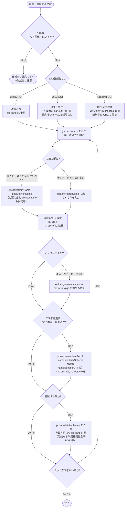

# 作成者 入力決定木（JPCOARスキーマ 2.0）

JPCOARスキーマの **作成者** を初心者が迷わず入力できるよう、FAO の LODE-BD 3.0 の決定木方式にならって作成したガイドです。フローチャートで道筋をたどり、対応表で使用する要素・属性と実例を確定します。

対象: JPCOARスキーマ **2.0**（要素 [#3 作成者](https://schema.irdb.nii.ac.jp/ja/schema/2.0/3) と下位項目）
利用シーン: **DOI登録（JaLC / Crossref）を重視**。必須度・`xml:lang` 要件は [JPCOAR/JaLC対照表 ver.1.5](../reference/JPCOAR_JaLC_Crossref_requirements.md) に準拠。

> 記号凡例は [README.md](README.md) と共通（楕円=開始/終了、ひし形=判断、長方形=処理、平行四辺形=入力）。

---

## 作成者決定木

---

## 決定プロセス対応表

| 判断 | 質問 | 回答 | アクション | 要素・属性 | 入力例 |
|------|------|------|-----------|-----------|--------|
| #0 | 作成者はいるか | いいえ | 作成者は記入しない | ― | ― |
| | | はい | #1 へ（第一著者から順に） | jpcoar:creator | |
| #1 | DOI登録先は | 登録しない / JaLC | 通常要件で続行 | | |
| | | Crossref | 姓名はxml:lang必須・識別子はORCID限定 | | |
| #2 | 名前の形は | 個人名（姓・名に分割可） | 姓と名を別々に入力 | `jpcoar:familyName` ＋ `jpcoar:givenName` | 山田 / 太郎 |
| | | 団体／単一文字列 | 氏名・名称をまとめて入力 | `jpcoar:creatorName` | 国立情報学研究所 |
| #3 | 言語・ヨミ | 日本語 | xml:lang設定 | `xml:lang="ja"` | 山田 太郎 |
| | | 英語 | xml:lang設定 | `xml:lang="en"` | Yamada, Taro |
| | | カナ読み | jaと併記 | `xml:lang="ja-Kana"` | ヤマダ タロウ |
| | | ローマ字読み | jaと併記 | `xml:lang="ja-Latn"` | Yamada, Taro |
| #4 | 識別子はあるか | はい | スキームを指定して入力 | `jpcoar:nameIdentifier nameIdentifierScheme="ORCID"` | 0000-0001-2345-6789 |
| | | いいえ | #5 へ | ― | ― |
| #5 | 所属はあるか | はい | 所属機関名を入力（複数言語ならxml:lang必須） | `jpcoar:affiliationName` | 国立情報学研究所 |
| | | いいえ | #6 へ | ― | ― |
| #6 | ほかに作成者がいるか | はい | #1 へ戻り次の著者を入力 | ― | ― |
| | | いいえ | 完了 | ― | ― |

---

## 注記（入力ルール）

- **記入順**: 複数の作成者がいる場合は **第一著者から順に** 記入します。
- **作成者と寄与者の区別**: 直接的に作成に関与した者を「作成者」、間接的に貢献した者（編者・翻訳者など役割が異なる者）は「寄与者」(#4) に記入します。
- **姓名(creatorName) と 姓+名(familyName/givenName) の使い分け**:
  - 姓と名を分けられる **個人名** は `familyName` ＋ `givenName` で入力すると検索・典拠連携に有利です。
  - **団体名** や分割が困難な名前は `creatorName`（単一文字列）に入力します。
  - 両者の併記も可能です（推奨例でも並記されています）。
- **言語・ヨミのルール**（タイトルと同様）: `xml:lang` は1要素1言語。カナ (`ja-Kana`) / ローマ字 (`ja-Latn`) のヨミを入れる場合は、必ず `xml:lang="ja"` の本文も併記します。
- **作成者識別子 nameIdentifierScheme の値**（統制語彙）:
  `e-Rad_Researcher` / `ORCID` / `ISNI` / `VIAF` / `AID` / `Ringgold` / `ROR` ほか。
  ※`NRID` `kakenhi` `GRID` は **非推奨**。HTTP URI 形式の ID は `nameIdentifierURI` にも記入できます。
- **DOI登録先による差分**（[対照表](../reference/JPCOAR_JaLC_Crossref_requirements.md) より）:
  - **JaLC DOI**: 作成者姓名は **条件付必須**（作成者を記入する場合は必須）。識別子スキームは制限なし。
  - **Crossref DOI**: 作成者姓名/姓/名は `xml:lang` **必須**。作成者識別子は **ORCID 限定**。所属機関名は複数の場合 `xml:lang` 必須。

---

## 参考

- JPCOARスキーマ 2.0 #3 作成者: https://schema.irdb.nii.ac.jp/ja/schema/2.0/3
- 作成者識別子: https://schema.irdb.nii.ac.jp/ja/schema/2.0/3-.1 ／ 作成者所属: https://schema.irdb.nii.ac.jp/ja/schema/2.0/3-.6
- 必須項目・DOI要件: [JPCOAR_JaLC_Crossref_requirements.md](../reference/JPCOAR_JaLC_Crossref_requirements.md)
- 手法の出典: Subirats, I. and Zeng, M.L. 2020. *Linked Open Data Enabled Bibliographical Data (LODE-BD) 3.0*. Rome, FAO. https://doi.org/10.4060/cb2209en
