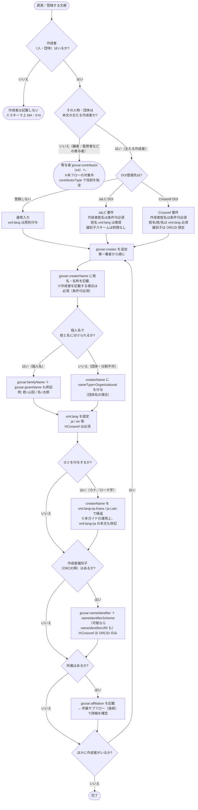
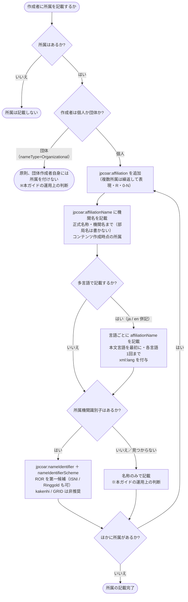

# 作成者 入力フローチャート

作成者の入力では、氏名を転記する前に、その人物や団体が資料の作成に直接関与したかを確かめます。
編者や監修者など、間接的に関与した者は寄与者として扱います。
翻訳者は公式に入力先が明示されていないため、本ガイドでは寄与者として扱います。

作成者であることを確定したら、まず姓名または団体名を記載します。
そのうえで、姓と名の分割、ヨミ、識別子、所属を補います。
最後に、DOI登録先に応じた `xml:lang` と識別子の要件を適用します。

対象は JPCOARスキーマ **2.0** の [#3 作成者](https://schema.irdb.nii.ac.jp/ja/schema/2.0/3) と下位項目です。
要素と属性の定義は [作成者記述ルール（公式準拠）](../reference/creator_rules.md)、DOI登録時の必須度と `xml:lang` 要件は [JPCOAR/JaLC対照表 ver.1.5](../reference/JPCOAR_JaLC_Crossref_requirements.md) を典拠とします。

`jpcoar:creator` は **MA（該当する場合は必須）、0-N（繰返可）** です。
作成者がいる場合は、第一著者から順に記載します。
作成者を記載する場合、作成者姓名 `jpcoar:creatorName` は DOI登録で **条件付必須**です。

## この項目の性質

評価の定義は [CONVENTIONS.md 第8節](CONVENTIONS.md) を参照してください。

| 観点 | 評価 |
|------|------|
| 入力の型 | **転記型＋調査型**。氏名と所属名は資料から転記し、作成者識別子（ORCID）と所属機関識別子（ROR 等）は外部で調べる。作成者か寄与者かの切り分けは解釈を伴う |
| 他項目への影響 | **あり**。編者や監修者などを寄与者（#4 `jpcoar:contributor`）へ振り分ける。翻訳者も本ガイドの解釈では寄与者へ振り分ける |
| 事前調査 | 任意だが推奨。ORCID（https://orcid.org）と ROR（https://ror.org）で識別子を検索する。見つからなければ名称のみで記載できる |
| 誤入力の影響 | 同姓同名の混同や研究業績との不整合が起きる。作成者姓名や Crossref DOI で必要な `xml:lang` が欠けると、DOI登録エラーになる |

---

## まず入力するもの

| 入力したい情報 | 入力先 | 基本ルール |
|--------------|--------|------------|
| 氏名・名称（まずこれを入れる） | `jpcoar:creatorName` | 姓名または団体名を1文字列で必ず記載する（作成者がある場合は条件付必須） |
| 個人名を姓と名に分ける | `jpcoar:familyName` ＋ `jpcoar:givenName` | 判別できる場合は `creatorName` に加えて補足的に記載する |
| カナ読み・ローマ字読み | `jpcoar:creatorName` ／ `jpcoar:creatorAlternative` | あれば `ja-Kana` / `ja-Latn` で記載する。本ガイドでは `ja` の本文も併記する |
| 作成者識別子（ORCID 等） | `jpcoar:nameIdentifier` | あれば記載し、`nameIdentifierScheme` で種類を示す |
| 所属機関 | `jpcoar:affiliationName` | できれば記載し、`jpcoar:affiliation` の下に入れる |

入力先を決めた後、氏名・名称の言語を `xml:lang` で示します。
姓名（`creatorName` / `familyName` / `givenName`）では **JaLC DOI は推奨、Crossref DOI は必須**です。

本ガイドでは、入力漏れと多言語の混在を防ぐため、原則としてすべての氏名に `xml:lang` を付与します。

---

## 記号凡例

記号・記入レベル（M / MA / R 等）・`xml:lang` 運用方針は [CONVENTIONS.md](CONVENTIONS.md) を参照してください。

---

## 作成者入力フローチャート


```mermaid
flowchart TD
    R([資源／登録する文献]) --> D0{作成者<br/>（人・団体）はいるか?}
    D0 -- いいえ --> ENDX([作成者は記載しない<br/>※スキーマ上 MA・0-N])
    D0 -- はい --> DC{その人物・団体は<br/>本文の主たる作成者か?}

    DC -- "いいえ（編者・監修者などの寄与者）" --> ENDC([寄与者 jpcoar:contributor（#4）へ<br/>※本フローの対象外<br/>contributorType で役割を指定])
    DC -- "はい（主たる作成者）" --> Q1{DOI登録先は?}

    Q1 -- 登録しない --> CTX0["通常入力<br/>xml:lang は原則付与"]
    Q1 -- JaLC DOI --> CTX1["JaLC 要件<br/>作成者姓名は条件付必須<br/>姓名 xml:lang は推奨<br/>識別子スキームは制限なし"]
    Q1 -- Crossref DOI --> CTX2["Crossref 要件<br/>作成者姓名は条件付必須<br/>姓名/姓/名は xml:lang 必須<br/>識別子は ORCID 限定"]

    CTX0 --> P1
    CTX1 --> P1
    CTX2 --> P1

    P1["jpcoar:creator を追加<br/>第一著者から順に"] --> P2["jpcoar:creatorName に姓名・名称を記載<br/>※作成者を記載する場合は必須（条件付必須）"]
    P2 --> D2{個人名で<br/>姓と名に分けられるか?}

    D2 -- "はい（個人名）" --> A2a["jpcoar:familyName ＋ jpcoar:givenName も併記<br/>例: 姓=山田 / 名=太郎"]
    D2 -- "いいえ（団体・分割不可）" --> A2b["creatorName に nameType=Organizational を付与<br/>（団体名の場合）"]

    A2a --> P3
    A2b --> P3

    P3["xml:lang を設定<br/>ja / en 等<br/>※Crossref は必須"] --> D3{ヨミを付与するか?}
    D3 -- "はい（カナ／ローマ字）" --> A3["creatorName を xml:lang=ja-Kana / ja-Latn で繰返<br/>※本ガイドの運用上、xml:lang=ja の本文も併記"]
    D3 -- いいえ --> D4
    A3 --> D4

    D4{作成者識別子<br/>（ORCID等）はあるか?}
    D4 -- "はい" --> A4["jpcoar:nameIdentifier ＋ nameIdentifierScheme<br/>（可能なら nameIdentifierURI も）<br/>※Crossref は ORCID のみ"]
    D4 -- いいえ --> D5
    A4 --> D5

    D5{所属はあるか?}
    D5 -- "はい" --> A5["jpcoar:affiliation を記載<br/>→ 所属サブフロー（後掲）で詳細を確定"]
    D5 -- いいえ --> D6
    A5 --> D6

    D6{ほかに作成者がいるか?}
    D6 -- "はい" --> P1
    D6 -- いいえ --> END([完了])
```

> **判断の要点**：最初に、その人物や団体が資料の作成に直接関与したかを確かめます。
> 編者や監修者などは、作成者ではなく寄与者 `jpcoar:contributor`（#4）に記載します。
> 翻訳者は、本ガイドでは寄与者に記載すると解釈します。
> 作成者であれば、まず `jpcoar:creatorName` に氏名または名称を記載します。
> Crossref DOI では姓名に `xml:lang` が必須となり、作成者識別子は ORCID に限られます。

---

## 作成者所属 `jpcoar:affiliation` サブフロー

作成者に所属がある場合は、所属機関名を中心に入力します。
`jpcoar:affiliation` は **R（推奨）、0-N（繰返可）** で、一人の作成者に複数の所属を記載できます。
下位には、所属機関識別子 `jpcoar:nameIdentifier` と所属機関名 `jpcoar:affiliationName` を置きます。


```mermaid
flowchart TD
    S0([作成者に所属を記載するか]) --> S0d{所属はあるか?}
    S0d -- いいえ --> SEND([所属は記載しない])
    S0d -- "はい" --> S1{作成者は個人か団体か?}

    S1 -- "団体（nameType=Organizational）" --> SORG([原則、団体作成者自身には所属を付けない<br/>※本ガイドの運用上の判断])
    S1 -- 個人 --> S2["jpcoar:affiliation を追加<br/>（複数所属は繰返して表現・R・0-N）"]

    S2 --> S3["jpcoar:affiliationName に機関名を記載<br/>正式名称・機関名まで（部局名は書かない）<br/>コンテンツ作成時点の所属"]
    S3 --> S4{多言語で記載するか?}

    S4 -- "はい（ja / en 併記）" --> S4a["言語ごとに affiliationName を記載<br/>本文言語を最初に・各言語1回まで<br/>xml:lang を付与"]
    S4 -- いいえ --> S5
    S4a --> S5

    S5{所属機関識別子はあるか?}
    S5 -- "はい" --> S5a["jpcoar:nameIdentifier ＋ nameIdentifierScheme<br/>ROR を第一候補（ISNI / Ringgold も可）<br/>kakenhi / GRID は非推奨"]
    S5 -- "いいえ／見つからない" --> S5b["名称のみで記載<br/>※本ガイドの運用上の判断"]
    S5a --> S6
    S5b --> S6

    S6{ほかに所属があるか?}
    S6 -- はい --> S2
    S6 -- いいえ --> SENDOK([所属の記載完了])
```

> **所属の要点**：複数の所属は、`jpcoar:affiliation` を繰り返して表現します。
> 所属機関名には、コンテンツ作成時点の正式名称を機関名まで記載し、部局名は含めません。
> 本ガイドでは所属機関識別子に ROR を優先しますが、見つからない場合は名称のみを記載します。
> 団体作成者には、原則としてその団体自身の所属を付けません。

---

## 入力プロセス対応表

| 判断 | 質問 | 回答 | アクション | 要素・属性 | 入力例 |
|------|------|------|-----------|-----------|--------|
| #0 | 作成者はいるか | いいえ | 作成者は記載しない（スキーマ上 MA・0-N） | ― | ― |
| | | はい | 主たる作成者か貢献者かを判定（次行） | `jpcoar:creator` | |
| #0b | 本文の主たる作成者か | いいえ（編者や監修者など） | 寄与者へ回す（本フロー対象外、`contributorType` で役割指定） | `jpcoar:contributor`（#4） | ― |
| | | はい（主たる作成者） | #1 へ（第一著者から順に） | `jpcoar:creator` | |
| #1 | DOI登録先は | 登録しない / JaLC | 通常要件で続行（姓名は条件付必須） | | |
| | | Crossref | 姓名は `xml:lang` 必須・識別子は ORCID 限定 | | |
| #2 | 氏名・名称を入力 | 共通 | まず姓名・名称を1文字列で記載 | `jpcoar:creatorName` | 山田, 太郎 |
| | 個人名で姓・名に分けられるか | はい（個人名） | 姓と名を別々に補足記載 | `jpcoar:familyName` ＋ `jpcoar:givenName` | 山田 / 太郎 |
| | | いいえ（団体） | 団体名に `nameType="Organizational"` を付与 | `jpcoar:creatorName nameType="Organizational"` | 国立情報学研究所 |
| #3 | 言語・ヨミ | 日本語 | `xml:lang` 設定 | `xml:lang="ja"` | 山田, 太郎 |
| | | 英語 | `xml:lang` 設定 | `xml:lang="en"` | Yamada, Taro |
| | | カナ読み | `ja` と併記 | `jpcoar:creatorName xml:lang="ja-Kana"` | ヤマダ, タロウ |
| | | ローマ字読み | `ja` と併記 | `jpcoar:creatorName xml:lang="ja-Latn"` | Yamada, Taro |
| #4 | 識別子はあるか | はい | スキームを指定して記載 | `jpcoar:nameIdentifier nameIdentifierScheme="ORCID"` | 0000-0001-2345-6789 |
| | | いいえ | #5 へ | ― | ― |
| #5 | 所属はあるか | はい | 所属サブフロー（後掲）で機関名・識別子・多言語・複数所属を確定 | `jpcoar:affiliation` > `jpcoar:affiliationName` | 国立情報学研究所 |
| | | いいえ | #6 へ | ― | ― |
| #6 | ほかに作成者がいるか | はい | #1 へ戻り次の著者を記載 | ― | ― |
| | | いいえ | 完了 | ― | ― |

---

## 使い分けの目安

| 迷いやすいケース | 判断 | 入力先 |
|----------------|------|--------|
| すべての作成者（個人・団体問わず） | まず姓名・名称を記載する | `jpcoar:creatorName`（条件付必須） |
| 「山田, 太郎」のように姓と名に分けられる個人名 | 個人名を補足 | `jpcoar:creatorName` ＋ `jpcoar:familyName` / `jpcoar:givenName` |
| 「国立情報学研究所」など団体名 | 団体 | `jpcoar:creatorName nameType="Organizational"`（姓・名には分けない） |
| 編者（編著書） | 作成に間接的に関与した者 | 寄与者 `jpcoar:contributor` `contributorType="Editor"`（#4） |
| 監修者 | 同上 | 寄与者 `jpcoar:contributor` `contributorType="Supervisor"`（#4） |
| 翻訳者のみの資料 | 本ガイドでは、原著者を作成者、翻訳者を寄与者と解釈する。専用値がないため翻訳者には `Other` を使用する | 原著者=`jpcoar:creator` ／ 翻訳者=`jpcoar:contributor` `contributorType="Other"`（#4） |
| 研究データの作成者と管理者 | 作成者と維持管理者を区別 | 作成者=`jpcoar:creator` ／ 管理者=`jpcoar:contributor` `contributorType="DataManager"` または `"DataCurator"`（#4） |
| 会議・シンポジウムの主催団体 | 提供機関 | 寄与者 `jpcoar:contributor` `contributorType="HostingInstitution"`（`nameType="Organizational"`）（#4） |
| 口述資料の話者・聞き手 | 本ガイドでは、話者を作成者、聞き手を寄与者と解釈する。専用値がない | 話者=`jpcoar:creator` ／ 聞き手=`jpcoar:contributor` `contributorType="Other"` または `"RelatedPerson"`（#4） |
| 権利者（著作権者） | 寄与者ではない | 権利者情報 `jpcoar:rightsHolder`（#7）へ（`contributorType` に RightsHolder は存在しない） |
| 助成者（ファンダー） | 寄与者ではない | 助成情報 `jpcoar:fundingReference`（#23）へ（`contributorType` に Funder は存在しない） |
| 氏名の読みを検索用に入れたい | ヨミ。本ガイドの運用上、`ja` の本文も併記する | `jpcoar:creatorName xml:lang="ja-Kana"` または `ja-Latn` |
| 旧姓・筆名など別の名前 | 本ガイドでは別名として扱う | `jpcoar:creatorAlternative` |

---

## 入力例

### 個人名（creatorName ＋ 姓・名の分割）＋カナヨミ

```xml
<jpcoar:creator>
  <jpcoar:creatorName xml:lang="ja">山田, 太郎</jpcoar:creatorName>
  <jpcoar:creatorName xml:lang="ja-Kana">ヤマダ, タロウ</jpcoar:creatorName>
  <jpcoar:familyName xml:lang="ja">山田</jpcoar:familyName>
  <jpcoar:givenName xml:lang="ja">太郎</jpcoar:givenName>
</jpcoar:creator>
```

### 個人名＋日英併記＋ORCID＋所属

```xml
<jpcoar:creator>
  <jpcoar:nameIdentifier nameIdentifierScheme="ORCID" nameIdentifierURI="https://orcid.org/0000-0001-2345-6789">0000-0001-2345-6789</jpcoar:nameIdentifier>
  <jpcoar:creatorName xml:lang="ja">山田, 太郎</jpcoar:creatorName>
  <jpcoar:creatorName xml:lang="en">Yamada, Taro</jpcoar:creatorName>
  <jpcoar:familyName xml:lang="ja">山田</jpcoar:familyName>
  <jpcoar:familyName xml:lang="en">Yamada</jpcoar:familyName>
  <jpcoar:givenName xml:lang="ja">太郎</jpcoar:givenName>
  <jpcoar:givenName xml:lang="en">Taro</jpcoar:givenName>
  <jpcoar:affiliation>
    <jpcoar:affiliationName xml:lang="ja">国立情報学研究所</jpcoar:affiliationName>
  </jpcoar:affiliation>
</jpcoar:creator>
```

### 団体名

```xml
<jpcoar:creator>
  <jpcoar:creatorName xml:lang="ja" nameType="Organizational">国立情報学研究所</jpcoar:creatorName>
</jpcoar:creator>
```

---

## 注記（入力ルール）

### スキーマ層

- `jpcoar:creator` は MA、0-Nです。
  作成者がいる場合に記載し、複数いる場合は要素を繰り返します。
- 学位論文では、作成者を必ず記載します。
- 複数の作成者は、第一著者から順に記載します。
- コンテンツの作成に直接関与した者を作成者、間接的に関与した者を寄与者（#4）として区別します。
  `contributorType` の統制語彙に該当する役割を持つ者は、寄与者に記載します。
- `jpcoar:creatorName` は MA、0-Nです。
  すべての作成者について、まず姓名または団体名を一つの文字列で記載します。
- 個人名は「姓, 名」の形式で記載します。
  姓と名を判別できる場合は、任意の `jpcoar:familyName` と `jpcoar:givenName` にも分けて記載できます。
- 団体名は姓と名に分けず、`jpcoar:creatorName` に `nameType="Organizational"` を付与します。
  `nameType` は推奨で、既定値は `Personal` です。
- `creatorType` は、作成に直接関与した者の役割を簡潔に示す任意属性です。
  公式入力例では `creatorType="著"` が使われています。
- `xml:lang` は一つの要素に一つの言語を指定します。
  各言語コードの `creatorName`、`familyName`、`givenName` は、それぞれ1回までです。
- カナヨミ `ja-Kana` とローマ字ヨミ `ja-Latn` は `jpcoar:creatorName` に記載します。
- `jpcoar:creatorAlternative` には作成者の別名を記載し、記述方法は `jpcoar:creatorName` に準じます。
  同じ言語でも複数の別名を記載できます。
- 作成者識別子の `nameIdentifierScheme` には、`e-Rad_Researcher`、`ORCID`、`ISNI`、`VIAF`、`AID`、`Ringgold`、`ROR` などを使用します。
  `NRID`、`kakenhi`、`GRID` は非推奨です。
- 識別子の値には接頭辞を付けず、IDのみを記載します。
  HTTP URI は `nameIdentifierURI` に記載します。
- `jpcoar:affiliation` は R、0-Nです。
  一人の作成者に複数の所属がある場合は、要素を繰り返します。
- `jpcoar:affiliationName` には、略称ではなく正式名称を記載します。
  部局名を含めず機関名までとし、コンテンツ作成時点の所属を記載します。
- 所属機関名を複数言語で記載する場合は、本文言語を最初にします。
  各言語コードの `affiliationName` は1回までです。
- 所属機関識別子には `ISNI`、`Ringgold`、`ROR` を使用できます。
  `kakenhi` と `GRID` は非推奨です。

作成者と混同しやすい `contributorType` は、次のとおりです。

| 値 | 役割 | 該当例 |
|----|------|--------|
| `Editor` | 編集者 | 編著書の編者 |
| `Supervisor` | 監督者 | 監修者 |
| `Producer` | 製作者 | 映像・音源等の製作者 |
| `DataManager` | データ維持管理者 | 研究データの管理者 |
| `DataCurator` | データキュレーター | 研究データのキュレーション担当 |
| `HostingInstitution` | 提供機関 | 会議主催団体・提供機関 |
| `Distributor` | 頒布者 | 資料の頒布者 |

JPCOARスキーマ 2.0 の `contributorType` 統制語彙は18値です。
この統制語彙に `Translator`、`RightsHolder`、`Funder`、`RegistrationAgency` という値はありません。

- 本ガイドでは、翻訳者を `jpcoar:contributor` の `contributorType="Other"` に記載すると解釈します。
- 権利者は寄与者ではなく、権利者情報 `jpcoar:rightsHolder`（#7）に記載します。
- 助成者は寄与者ではなく、助成情報 `jpcoar:fundingReference`（#23）に記載します。

### DOI登録層

[対照表](../reference/JPCOAR_JaLC_Crossref_requirements.md) では、登録先によって次の要件が加わります。

| DOI登録先 | 作成者姓名 | 姓名・姓・名の `xml:lang` | 作成者識別子 | 所属機関名 |
|-----------|------------|--------------------------|--------------|------------|
| JaLC DOI | 条件付必須 | 推奨 | スキームの制限なし | 任意。複数の場合は `xml:lang` 必須 |
| Crossref DOI | 条件付必須 | 必須 | ORCID 限定 | 任意。複数の場合は `xml:lang` 必須 |

作成者姓名の条件付必須とは、作成者を記載する場合に `jpcoar:creatorName` が必須になることを指します。

### 本ガイドの運用方針

- 入力漏れと多言語の混在を防ぐため、原則としてすべての氏名に `xml:lang` を付与します。
- カナヨミまたはローマ字ヨミを記載する場合は、`xml:lang="ja"` の本文も併記します。
- 個人名で姓と名を判別できる場合は、`jpcoar:creatorName` に加えて `jpcoar:familyName` と `jpcoar:givenName` を記載します。
- 旧姓や筆名は、`jpcoar:creatorAlternative` に記載します。
- 所属機関識別子は ROR を第一候補とし、<https://ror.org> で機関名から検索します。
  見つからない場合は、所属機関名のみを記載します。
- 団体作成者（`nameType="Organizational"`）には、原則としてその団体自身の所属を付けません。
  これは公式規定ではなく、本ガイドの運用上の判断です。
- 所属の詳しい入力手順は、[所属サブフロー](#作成者所属-jpcoaraffiliation-サブフロー)を参照してください。

---

## 参考

- JPCOARスキーマ 2.0 #3 作成者: https://schema.irdb.nii.ac.jp/ja/schema/2.0/3
- 作成者識別子: https://schema.irdb.nii.ac.jp/ja/schema/2.0/3-.1 ／ 作成者所属: https://schema.irdb.nii.ac.jp/ja/schema/2.0/3-.6
- 要素・属性の記述ルール（公式準拠）: [creator_rules.md](../reference/creator_rules.md)
- 必須項目・DOI要件: [JPCOAR_JaLC_Crossref_requirements.md](../reference/JPCOAR_JaLC_Crossref_requirements.md)
- 手法の出典: Subirats, I. and Zeng, M.L. 2020. *Linked Open Data Enabled Bibliographical Data (LODE-BD) 3.0*. Rome, FAO. https://doi.org/10.4060/cb2209en
