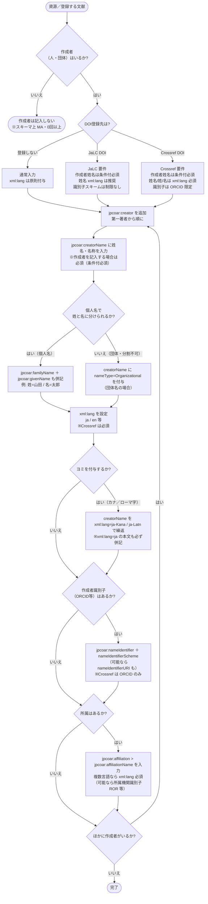

# 作成者 入力フローチャート

初心者が JPCOARスキーマの **作成者** を迷わず入力できるよう、フローチャートで道筋をたどり、対応表で使用する要素・属性を確定します。

対象: JPCOARスキーマ **2.0**（要素 [#3 作成者](https://schema.irdb.nii.ac.jp/ja/schema/2.0/3) と下位項目）
利用シーン: **DOI登録（JaLC / Crossref）を重視**。要素・属性の定義は [作成者記述ルール（公式準拠）](../reference/creator_rules.md)、必須度・`xml:lang` 要件は [JPCOAR/JaLC対照表 ver.1.5](../reference/JPCOAR_JaLC_Crossref_requirements.md) に準拠。

`jpcoar:creator` はスキーマ上 **MA（該当する場合は必須・0回以上）** で、作成者がいる場合に第一著者から順に記入します。作成者を記入する場合、作成者姓名 `jpcoar:creatorName` は DOI登録で **条件付必須**（作成者がある場合は必須）です。

## この項目の性質

4観点の定義は [CONVENTIONS.md 第8節](CONVENTIONS.md) を参照。

| 観点 | 評価 |
|------|------|
| 入力の型 | **転記型＋調査型** — 氏名・所属名は資料からの転記、作成者識別子（ORCID）・所属機関識別子（ROR 等）は外部調査。creator か寄与者（contributor）かの切り分けのみ解釈を伴う |
| 他項目への影響 | あり — 寄与者（#4 `jpcoar:contributor`）との切り分け（翻訳者・編者・監修者などは寄与者側に入れる） |
| 事前調査 | 任意だが推奨 — ORCID（https://orcid.org）・ROR（https://ror.org）で識別子を検索。見つからなければ名称のみで可 |
| 誤入力の影響 | 著者の同定不能（同姓同名の混同・研究業績との不整合）、DOI登録エラー（作成者がいる場合の姓名欠落、Crossref の `xml:lang` 欠落） |

---

## まず入力するもの

| 入力したい情報 | 入力先 | 基本ルール |
|--------------|--------|------------|
| 氏名・名称（まずこれを入れる） | `jpcoar:creatorName` | 姓名または団体名を1文字列で入力（条件付必須） |
| 個人名を姓と名に分ける | `jpcoar:familyName` ＋ `jpcoar:givenName` | `creatorName` に加えて補足的に入力する |
| カナ読み・ローマ字読み | `jpcoar:creatorName` ／ `jpcoar:creatorAlternative` | `ja-Kana` / `ja-Latn` を使い、`ja` の本文も併記する |
| 作成者識別子（ORCID 等） | `jpcoar:nameIdentifier` | `nameIdentifierScheme` で種類を示す |
| 所属機関 | `jpcoar:affiliationName` | `jpcoar:affiliation` の下に入力する |

`xml:lang` は、姓名（`creatorName` / `familyName` / `givenName`）で **JaLC DOI＝推奨 / Crossref DOI＝必須** です。このガイドでは入力漏れと多言語混在を防ぐため、**原則としてすべての氏名に付与**します。

---

## 記号凡例

記号・記入レベル（M / MA / R 等）・`xml:lang` 運用方針は [CONVENTIONS.md](CONVENTIONS.md) を参照してください。

---

## 作成者入力フローチャート


```mermaid
flowchart TD
    R([資源／登録する文献]) --> D0{作成者<br/>（人・団体）はいるか?}
    D0 -- いいえ --> ENDX([作成者は記入しない<br/>※スキーマ上 MA・0回以上])
    D0 -- はい --> Q1{DOI登録先は?}

    Q1 -- 登録しない --> CTX0["通常入力<br/>xml:lang は原則付与"]
    Q1 -- JaLC DOI --> CTX1["JaLC 要件<br/>作成者姓名は条件付必須<br/>姓名 xml:lang は推奨<br/>識別子スキームは制限なし"]
    Q1 -- Crossref DOI --> CTX2["Crossref 要件<br/>作成者姓名は条件付必須<br/>姓名/姓/名は xml:lang 必須<br/>識別子は ORCID 限定"]

    CTX0 --> P1
    CTX1 --> P1
    CTX2 --> P1

    P1["jpcoar:creator を追加<br/>第一著者から順に"] --> P2["jpcoar:creatorName に姓名・名称を入力<br/>※作成者を記入する場合は必須（条件付必須）"]
    P2 --> D2{個人名で<br/>姓と名に分けられるか?}

    D2 -- "はい（個人名）" --> A2a["jpcoar:familyName ＋ jpcoar:givenName も併記<br/>例: 姓=山田 / 名=太郎"]
    D2 -- "いいえ（団体・分割不可）" --> A2b["creatorName に nameType=Organizational を付与<br/>（団体名の場合）"]

    A2a --> P3
    A2b --> P3

    P3["xml:lang を設定<br/>ja / en 等<br/>※Crossref は必須"] --> D3{ヨミを付与するか?}
    D3 -- "はい（カナ／ローマ字）" --> A3["creatorName を xml:lang=ja-Kana / ja-Latn で繰返<br/>※xml:lang=ja の本文も必ず併記"]
    D3 -- いいえ --> D4
    A3 --> D4

    D4{作成者識別子<br/>（ORCID等）はあるか?}
    D4 -- "はい" --> A4["jpcoar:nameIdentifier ＋ nameIdentifierScheme<br/>（可能なら nameIdentifierURI も）<br/>※Crossref は ORCID のみ"]
    D4 -- いいえ --> D5
    A4 --> D5

    D5{所属はあるか?}
    D5 -- "はい" --> A5["jpcoar:affiliation > jpcoar:affiliationName を入力<br/>複数言語なら xml:lang 必須<br/>（可能なら所属機関識別子 ROR 等）"]
    D5 -- いいえ --> D6
    A5 --> D6

    D6{ほかに作成者がいるか?}
    D6 -- "はい" --> P1
    D6 -- いいえ --> END([完了])
```

> **ポイント**: まず `jpcoar:creatorName` に氏名・名称を入れます（作成者がある場合は必須）。個人名は `familyName` ＋ `givenName` を補足します。Crossref DOI では姓名（`creatorName` / `familyName` / `givenName`）に `xml:lang` が必須で、作成者識別子は ORCID に限定されます。

---

## 入力プロセス対応表

| 判断 | 質問 | 回答 | アクション | 要素・属性 | 入力例 |
|------|------|------|-----------|-----------|--------|
| #0 | 作成者はいるか | いいえ | 作成者は記入しない（スキーマ上 MA・0回以上） | ― | ― |
| | | はい | #1 へ（第一著者から順に） | `jpcoar:creator` | |
| #1 | DOI登録先は | 登録しない / JaLC | 通常要件で続行（姓名は条件付必須） | | |
| | | Crossref | 姓名は `xml:lang` 必須・識別子は ORCID 限定 | | |
| #2 | 氏名・名称を入力 | 共通 | まず姓名・名称を1文字列で入力 | `jpcoar:creatorName` | 山田, 太郎 |
| | 個人名で姓・名に分けられるか | はい（個人名） | 姓と名を別々に補足入力 | `jpcoar:familyName` ＋ `jpcoar:givenName` | 山田 / 太郎 |
| | | いいえ（団体） | 団体名に `nameType="Organizational"` を付与 | `jpcoar:creatorName nameType="Organizational"` | 国立情報学研究所 |
| #3 | 言語・ヨミ | 日本語 | `xml:lang` 設定 | `xml:lang="ja"` | 山田, 太郎 |
| | | 英語 | `xml:lang` 設定 | `xml:lang="en"` | Yamada, Taro |
| | | カナ読み | `ja` と併記 | `jpcoar:creatorName xml:lang="ja-Kana"` | ヤマダ, タロウ |
| | | ローマ字読み | `ja` と併記 | `jpcoar:creatorName xml:lang="ja-Latn"` | Yamada, Taro |
| #4 | 識別子はあるか | はい | スキームを指定して入力 | `jpcoar:nameIdentifier nameIdentifierScheme="ORCID"` | 0000-0001-2345-6789 |
| | | いいえ | #5 へ | ― | ― |
| #5 | 所属はあるか | はい | 所属機関名を入力（複数言語なら `xml:lang` 必須） | `jpcoar:affiliation` > `jpcoar:affiliationName` | 国立情報学研究所 |
| | | いいえ | #6 へ | ― | ― |
| #6 | ほかに作成者がいるか | はい | #1 へ戻り次の著者を入力 | ― | ― |
| | | いいえ | 完了 | ― | ― |

---

## 使い分けの目安

| 迷いやすいケース | 判断 | 入力先 |
|----------------|------|--------|
| すべての作成者（個人・団体問わず） | まず姓名・名称を入れる | `jpcoar:creatorName`（条件付必須） |
| 「山田, 太郎」のように姓と名に分けられる個人名 | 個人名を補足 | `jpcoar:creatorName` ＋ `jpcoar:familyName` / `jpcoar:givenName` |
| 「国立情報学研究所」など団体名 | 団体 | `jpcoar:creatorName nameType="Organizational"`（姓・名には分けない） |
| 編者・翻訳者など、作成に間接的に関与した者 | 作成者ではない | 寄与者 `jpcoar:contributor`（#4） |
| 氏名の読みを検索用に入れたい | ヨミ | `jpcoar:creatorName xml:lang="ja-Kana"` または `ja-Latn`（`ja` も併記） |
| 旧姓・筆名など別の名前 | 別名 | `jpcoar:creatorAlternative` |

---

## 入力例

### 個人名（creatorName ＋ 姓・名の分割）＋カナヨミ

```xml
<jpcoar:creator>
  <jpcoar:creatorName xml:lang="ja">山田, 太郎</jpcoar:creatorName>
  <jpcoar:creatorName xml:lang="ja-Kana">ヤマダ, タロウ</jpcoar:creatorName>
  <jpcoar:familyName xml:lang="ja">山田</jpcoar:familyName>
  <jpcoar:givenName xml:lang="ja">太郎</jpcoar:givenName>
</jpcoar:creator>
```

### 個人名＋日英併記＋ORCID＋所属

```xml
<jpcoar:creator>
  <jpcoar:nameIdentifier nameIdentifierScheme="ORCID" nameIdentifierURI="https://orcid.org/0000-0001-2345-6789">0000-0001-2345-6789</jpcoar:nameIdentifier>
  <jpcoar:creatorName xml:lang="ja">山田, 太郎</jpcoar:creatorName>
  <jpcoar:creatorName xml:lang="en">Yamada, Taro</jpcoar:creatorName>
  <jpcoar:familyName xml:lang="ja">山田</jpcoar:familyName>
  <jpcoar:familyName xml:lang="en">Yamada</jpcoar:familyName>
  <jpcoar:givenName xml:lang="ja">太郎</jpcoar:givenName>
  <jpcoar:givenName xml:lang="en">Taro</jpcoar:givenName>
  <jpcoar:affiliation>
    <jpcoar:affiliationName xml:lang="ja">国立情報学研究所</jpcoar:affiliationName>
  </jpcoar:affiliation>
</jpcoar:creator>
```

### 団体名

```xml
<jpcoar:creator>
  <jpcoar:creatorName xml:lang="ja" nameType="Organizational">国立情報学研究所</jpcoar:creatorName>
</jpcoar:creator>
```

---

## 注記（入力ルール）

- **要素の必須度**: `jpcoar:creator` はスキーマ上 MA（該当する場合は必須・0回以上）。作成者がいる場合に記入します。作成者を記入する場合、`jpcoar:creatorName` は DOI登録で**条件付必須**です。
- **このガイドの運用方針**: `xml:lang` は原則付与します。姓名は JaLC DOI＝推奨 / Crossref DOI＝必須です。
- **記入順**: 複数の作成者がいる場合は **第一著者から順に** 記入します。
- **作成者と寄与者の区別**: 直接的に作成に関与した者を「作成者」、間接的に関与した者（`contributorType` の役割に該当する者など）は「寄与者」(#4) に記入します。学位論文の場合は作成者を必ず入力します。
- **creatorName と familyName/givenName の使い分け**:
  - すべての作成者について、まず `jpcoar:creatorName`（姓名・名称を1文字列）を入力します。個人名は「姓, 名」（姓・カンマ・スペース区切り）で記入します。
  - **個人名**で姓と名が判別できる場合は、加えて `familyName` ＋ `givenName` を補足すると検索・典拠連携に有利です（いずれも任意）。
  - **団体名**は姓・名に分けず `creatorName` のみとし、`nameType="Organizational"` を付与します（`nameType` は推奨、既定は `Personal`）。
- **creatorType 属性**: 作成に直接関わった者の役割を簡潔に示す任意属性です（公式入力例では `creatorType="著"`）。
- **言語・ヨミのルール**: `xml:lang` は1要素1言語。各言語コードの `creatorName` / `familyName` / `givenName` の出現回数は1回までです。カナ (`ja-Kana`) / ローマ字 (`ja-Latn`) のヨミを入れる場合は、必ず `xml:lang="ja"` の本文も併記します。
- **別名**: 旧姓・筆名などは `jpcoar:creatorAlternative` に記入します（記述方法は `creatorName` に準じる）。
- **作成者識別子 `nameIdentifierScheme` の値**（統制語彙）:
  `e-Rad_Researcher` / `ORCID` / `ISNI` / `VIAF` / `AID` / `Ringgold` / `ROR` ほか。
  ※`NRID` / `kakenhi` / `GRID` は **非推奨**。ID は接頭辞を付けず ID のみを記入し、HTTP URI は `nameIdentifierURI` に記入します。
- **所属機関名**: 略称ではなく正式名称を、機関名まで（部局名は記入しない）入力します。所属機関識別子のスキームは `ISNI` / `Ringgold` / `ROR` ほか（`kakenhi` / `GRID` は非推奨）。
- **DOI登録先による差分**（[対照表](../reference/JPCOAR_JaLC_Crossref_requirements.md) より）:
  - **JaLC DOI**: 作成者姓名は **条件付必須**（作成者を記入する場合は必須）。姓名 `xml:lang` は推奨。識別子スキームは制限なし。
  - **Crossref DOI**: 作成者姓名は **条件付必須**。姓名/姓/名は `xml:lang` **必須**。作成者識別子は **ORCID 限定**。所属機関名は複数の場合 `xml:lang` 必須。

---

## 参考

- JPCOARスキーマ 2.0 #3 作成者: https://schema.irdb.nii.ac.jp/ja/schema/2.0/3
- 作成者識別子: https://schema.irdb.nii.ac.jp/ja/schema/2.0/3-.1 ／ 作成者所属: https://schema.irdb.nii.ac.jp/ja/schema/2.0/3-.6
- 要素・属性の記述ルール（公式準拠）: [creator_rules.md](../reference/creator_rules.md)
- 必須項目・DOI要件: [JPCOAR_JaLC_Crossref_requirements.md](../reference/JPCOAR_JaLC_Crossref_requirements.md)
- 手法の出典: Subirats, I. and Zeng, M.L. 2020. *Linked Open Data Enabled Bibliographical Data (LODE-BD) 3.0*. Rome, FAO. https://doi.org/10.4060/cb2209en
</content>
