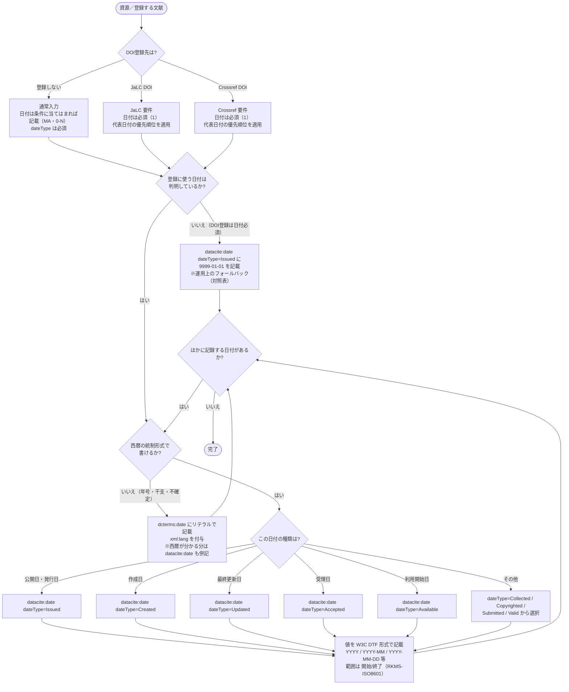

# 日付 入力フローチャート

初心者が JPCOARスキーマの **日付** を迷わず入力できるよう、フローチャートで道筋をたどり、対応表で使用する要素・属性を確定します。

対象: JPCOARスキーマ **2.0**（要素 [#12 日付](https://schema.irdb.nii.ac.jp/ja/schema/2.0/12) / [#13 日付（リテラル）](https://schema.irdb.nii.ac.jp/ja/schema/2.0/13)）
利用シーン: **DOI登録（JaLC / Crossref）を重視**。要素・属性の定義は [日付記述ルール（公式準拠）](../reference/date_rules.md)、必須度・優先順位は [JPCOAR/JaLC対照表 ver.1.5](../reference/JPCOAR_JaLC_Crossref_requirements.md) に準拠。

`datacite:date` はスキーマ上 **MA（条件に当てはまる場合は記載・0-N）** で、日付があれば記載し、繰り返し記載できます。DOI登録（JaLC / Crossref）では **必須（1）** なので、登録に使う日付を必ず1つ記載します。`dateType` 属性は **M（必須）** で、日付の種類を必ず指定します。

## この項目の性質

4観点の定義は [CONVENTIONS.md 第8節](CONVENTIONS.md) を参照。

| 観点 | 評価 |
|------|------|
| 入力の型 | **解釈型＋転記型** — `dateType` 9種から資料の状況に合う種類を選ぶのが解釈、日付の値そのものは奥付・書誌からの転記 |
| 他項目への影響 | あり — DOI登録の代表日付の選定に波及（対照表の優先順位に従う）。学位授与年月日（別要素）との関係にも注意 |
| 事前調査 | 不要 — 奥付・書誌情報から判断できる |
| 誤入力の影響 | DOI メタデータの発行年の誤表示、早期公開・改版時に版の同定が混乱 |

---

## まず入力するもの

| 入力したい情報 | 入力先 | 基本ルール |
|--------------|--------|------------|
| 発行日・公開日 | `datacite:date dateType="Issued"` | DOI登録の代表日付として最優先で記載する |
| 作成日・更新日・受理日など | `datacite:date` ＋ 該当 `dateType` | あれば記載し、種類を `dateType` で指定する |
| 西暦で書けない日付（年号・干支・不確定） | `dcterms:date`（リテラル） | 自由記述で記載し、`xml:lang` を付与する。西暦が分かる分は `datacite:date` も併記する |
| 日付の範囲 | `datacite:date` | `開始/終了`（例 `2004-03-02/2005-06-02`）で記載する |

`datacite:date` の値は W3C DTF 形式（`YYYY` / `YYYY-MM` / `YYYY-MM-DD` 等）で入力します。

---

## 記号凡例

記号・記入レベル（M / MA / O 等）・`xml:lang` 運用方針は [CONVENTIONS.md](CONVENTIONS.md) を参照してください。

---

## 日付入力フローチャート



> **ポイント**: `dateType` の選択は**スキーマ層**の話、代表日付の優先順位（`Issued > dateGranted > Created > Updated`）と `9999-01-01` フォールバックは**DOI登録層（運用）**の話です。両者を混同しないよう分けて扱います。`dateGranted` は `dateType` の統制語彙ではなく、学位授与年月日（別要素）由来の代表日付候補です。

---

## 入力プロセス対応表

| 判断 | 質問 | 回答 | アクション | 要素・属性 | 入力例 |
|------|------|------|-----------|-----------|--------|
| #1 | DOI登録先は | 登録しない | 日付は条件に当てはまれば記載（スキーマ MA・0-N）。記載する場合は `dateType` 必須 | `datacite:date` | |
| | | JaLC / Crossref | 日付は必須（1）。代表日付の優先順位を適用 | `datacite:date` | |
| #2 | 登録に使う日付は判明しているか | いいえ | `Issued` に `9999-01-01`（運用上のフォールバック） | `datacite:date dateType="Issued"` | 9999-01-01 |
| | | はい | #3 へ | ― | ― |
| #3 | 西暦の統制形式で書けるか | いいえ | リテラルで記載し `xml:lang` 付与 | `dcterms:date xml:lang="ja"` | 寛政壬子 |
| | | はい | #4 へ | ― | ― |
| #4 | 日付の種類は | 公開日・発行日 | `dateType="Issued"` | `datacite:date dateType="Issued"` | 2015-10-01 |
| | | 作成日 | `dateType="Created"` | `datacite:date dateType="Created"` | 2015-09-01 |
| | | 最終更新日 | `dateType="Updated"` | `datacite:date dateType="Updated"` | 2016-04-01 |
| | | 受理日 | `dateType="Accepted"` | `datacite:date dateType="Accepted"` | 2015-08-15 |
| | | 利用開始日 | `dateType="Available"` | `datacite:date dateType="Available"` | 2016-01-01 |
| | | その他 | `Collected` / `Copyrighted` / `Submitted` / `Valid` から選択 | `datacite:date dateType="Collected"` | 2004-03-02/2005-06-02 |
| #5 | 値の形式 | 単一日付 | W3C DTF 形式で記載 | `YYYY` / `YYYY-MM` / `YYYY-MM-DD` | 2015-10-01 |
| | | 範囲 | `開始/終了`（RKMS-ISO8601） | `datacite:date` | 2004-03-02/2005-06-02 |
| #6 | ほかに記録する日付があるか | はい | #3 へ戻り次の日付を記載 | ― | ― |
| | | いいえ | 完了 | ― | ― |

---

## 使い分けの目安

| 迷いやすいケース | 判断 | 入力先 |
|----------------|------|--------|
| 雑誌に掲載された発行年月日 | 発行日 | `datacite:date dateType="Issued"` |
| リポジトリで公開を開始した日 | 利用開始日 | `datacite:date dateType="Available"` |
| 「寛政壬子」「崇禎17」など西暦でない日付 | リテラル | `dcterms:date xml:lang="..."`（西暦が分かれば `datacite:date` も併記） |
| 観測・収集が一定期間にわたる場合 | 範囲 | `datacite:date dateType="Collected">開始/終了` |
| DOI登録するが日付が不明 | フォールバック | `datacite:date dateType="Issued">9999-01-01`（運用） |

---

## 入力例

### 発行日のみ

```xml
<datacite:date dateType="Issued">2015-10-01</datacite:date>
```

### 発行日＋利用開始日

```xml
<datacite:date dateType="Issued">2015-10-01</datacite:date>
<datacite:date dateType="Available">2016-01-01</datacite:date>
```

### 西暦でない日付（リテラル＋西暦併記）

```xml
<datacite:date dateType="Issued">1792</datacite:date>
<dcterms:date xml:lang="ja">寛政壬子</dcterms:date>
```

### 日付が不明（DOI登録のフォールバック）

```xml
<datacite:date dateType="Issued">9999-01-01</datacite:date>
```

---

## 注記（入力ルール）

- **要素の必須度**: `datacite:date` はスキーマ上 MA（条件に当てはまる場合は記載・0-N）で、あれば記載し、繰り返し記載できます。DOI登録（JaLC / Crossref）では **必須（1）** なので、登録に使う日付を必ず1つ記載します。
- **`dateType` は必須**: `datacite:date` を記載する場合、種類を表す `dateType` 属性は M（必須）です。つまり、日付の値だけでなく「発行日」「作成日」などの種類も必ず選びます。
- **値の形式**: W3C Date and Time Formats（`YYYY` / `YYYY-MM` / `YYYY-MM-DD` / `YYYY-MM-DDThh:mmTZD`）。範囲は RKMS-ISO8601 に従い `開始/終了` 形式で記載します。
- **`datacite:date`（型付き）と `dcterms:date`（リテラル）の使い分け**: 西暦の確定した日付は `datacite:date`、年号・干支・不確定年など統制形式で書けない日付は `dcterms:date` に記載します。西暦紀年が分かる場合は `datacite:date` の併用が推奨されます。
- **代表日付の優先順位（DOI登録層・運用）**: 複数の日付がある場合、DOI登録で代表として用いる日付は対照表の優先順 **`Issued > dateGranted > Created > Updated`** で決まります。これは DOI登録の運用ルールであり、スキーマの `dateType` 選択とは別レイヤーです。なお `dateGranted` は `dateType` の統制語彙ではなく、学位授与年月日（別要素）由来の候補です。
- **日付不明時のフォールバック（DOI登録層・運用）**: DOI登録で日付が判明しない場合、`datacite:date dateType="Issued"` に `9999-01-01` を記載します（出典: 対照表 ver.1.5）。これはスキーマの記述ではなく運用上の措置です。
- **DOI登録先による差分**（[対照表](../reference/JPCOAR_JaLC_Crossref_requirements.md) より）:
  - **JaLC DOI**: 日付は必須（1）。
  - **Crossref DOI**: 日付は必須（1）。

---

## 参考

- JPCOARスキーマ 2.0 #12 日付: https://schema.irdb.nii.ac.jp/ja/schema/2.0/12
- JPCOARスキーマ 2.0 #13 日付（リテラル）: https://schema.irdb.nii.ac.jp/ja/schema/2.0/13
- 要素・属性の記述ルール（公式準拠）: [date_rules.md](../reference/date_rules.md)
- 必須項目・DOI要件: [JPCOAR_JaLC_Crossref_requirements.md](../reference/JPCOAR_JaLC_Crossref_requirements.md)
- 手法の出典: Subirats, I. and Zeng, M.L. 2020. *Linked Open Data Enabled Bibliographical Data (LODE-BD) 3.0*. Rome, FAO. https://doi.org/10.4060/cb2209en
