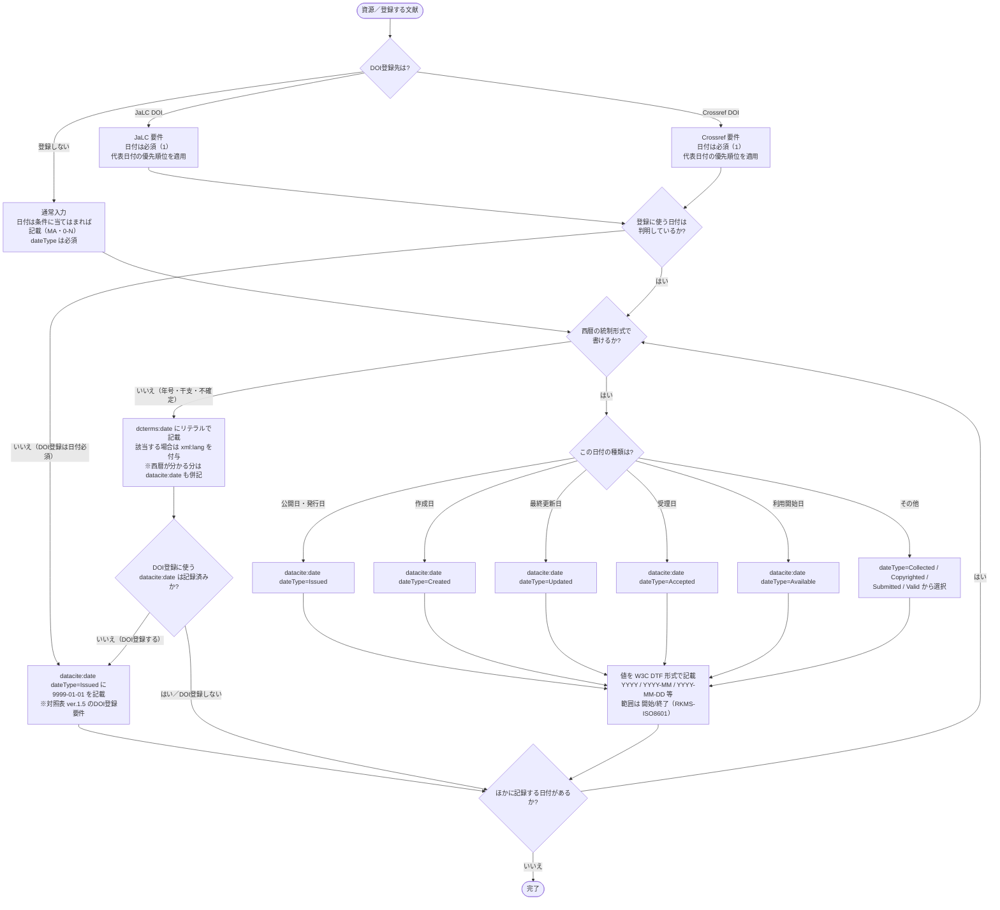

# 日付 入力フローチャート

日付は、値を写すだけでは入力先が決まりません。
発行日、利用開始日、受理日では `dateType` が異なり、西暦で表せない日付には別の要素を使います。
DOI登録では、複数の日付から登録に使う1件を選ぶ必要もあります。

まず日付を西暦の統制形式で記載できるか確認し、記載できる場合は種類を確定します。
そのうえで、DOI登録時の代表日付と不明時の扱いを適用します。

対象は JPCOARスキーマ **2.0** の [#12 日付](https://schema.irdb.nii.ac.jp/ja/schema/2.0/12) と [#13 日付（リテラル）](https://schema.irdb.nii.ac.jp/ja/schema/2.0/13) です。
要素と属性の定義は [日付記述ルール（公式準拠）](../reference/date_rules.md)、DOI登録時の必須度と代表日付の優先順位は [JPCOAR/JaLC対照表 ver.1.5](../reference/JPCOAR_JaLC_Crossref_requirements.md) を典拠とします。

`datacite:date` は **MA（該当する場合は必須）、0-N（繰返可）** です。
日付情報がある場合に記載します。
DOI登録では **必須（1）** となり、登録に使う日付を1つ記載します。
`dateType` 属性は **M（必須）、1（繰返不可）** です。
`datacite:date` ごとに日付の種類を指定します。
`dcterms:date` は **O（任意）、0-N（繰返可）** です。
統制形式で記載できない日付を補完します。

## この項目の性質

評価の定義は [CONVENTIONS.md 第8節](CONVENTIONS.md) を参照してください。

| 観点 | 評価 |
|------|------|
| 入力の型 | **解釈型と転記型**。`dateType` 9種から日付の種類を選び、値は奥付や書誌情報から写す |
| 他項目への影響 | **あり**。DOI登録の代表日付の選定に波及する。学位授与年月日は別要素であるため、混同にも注意する |
| 事前調査 | 不要。奥付や書誌情報から判断できる |
| 誤入力の影響 | DOIメタデータの発行年が誤って表示され、早期公開や改版で版の同定が難しくなる |

---

## まず入力するもの

| 入力したい情報 | 入力先 | 基本ルール |
|--------------|--------|------------|
| 発行日、公開日 | `datacite:date dateType="Issued"` | DOI登録の代表日付として最優先で記載する |
| 作成日、更新日、受理日など | `datacite:date` と該当する `dateType` | あれば記載し、種類を `dateType` で指定する |
| 西暦で書けない日付（年号、干支、不確定） | `dcterms:date`（リテラル） | 自由記述で記載し、`xml:lang` を付与する。西暦が分かる場合は `datacite:date` も併記する |
| コンテンツの内容に関する時間的範囲 | `dcterms:temporal`（時間的範囲） | コンテンツの作成日や発行日とは分けて記載する |
| 日付の範囲 | `datacite:date` | `開始/終了`（例 `2004-03-02/2005-06-02`）で記載する |

`datacite:date` の値は W3C DTF 形式（`YYYY` / `YYYY-MM` / `YYYY-MM-DD` 等）で入力します。

---

## 記号凡例

記号・記入レベル（M / MA / O 等）・`xml:lang` 運用方針は [CONVENTIONS.md](CONVENTIONS.md) を参照してください。

---

## 日付入力フローチャート



> **判断の要点**：`dateType` は、記録する日付そのものの種類を示します。
> DOI登録時の優先順位は、複数の日付から登録に使う1件を選ぶ規則です。
> `dateGranted` は `dateType` の統制語彙ではなく、別要素の学位授与年月日に由来する候補です。

---

## 入力プロセス対応表

| 判断 | 質問 | 回答 | アクション | 要素・属性 | 入力例 |
|------|------|------|-----------|-----------|--------|
| #1 | DOI登録先は | 登録しない | 日付は条件に当てはまれば記載（スキーマ MA・0-N）。記載する場合は `dateType` 必須 | `datacite:date` | |
| | | JaLC / Crossref | 日付は必須（1）。代表日付の優先順位を適用 | `datacite:date` | |
| #2 | 登録に使う日付は判明しているか | いいえ | 対照表 ver.1.5 のDOI登録要件に従い、`Issued` に `9999-01-01` を記載 | `datacite:date dateType="Issued"` | 9999-01-01 |
| | | はい | #3 へ | ― | ― |
| #3 | 西暦の統制形式で書けるか | いいえ | リテラルで記載し、該当する場合は `xml:lang` 付与。DOI登録時は代表用の `datacite:date` も必要 | `dcterms:date xml:lang="ja"` | 寛政壬子 |
| | | はい | #4 へ | ― | ― |
| #4 | 日付の種類は | 公開日・発行日 | `dateType="Issued"` | `datacite:date dateType="Issued"` | 2015-10-01 |
| | | 作成日 | `dateType="Created"` | `datacite:date dateType="Created"` | 2015-09-01 |
| | | 最終更新日 | `dateType="Updated"` | `datacite:date dateType="Updated"` | 2016-04-01 |
| | | 受理日 | `dateType="Accepted"` | `datacite:date dateType="Accepted"` | 2015-08-15 |
| | | 利用開始日 | `dateType="Available"` | `datacite:date dateType="Available"` | 2016-01-01 |
| | | その他 | `Collected` / `Copyrighted` / `Submitted` / `Valid` から選択 | `datacite:date dateType="Collected"` | 2004-03-02/2005-06-02 |
| #5 | 値の形式 | 単一日付 | W3C DTF 形式で記載 | `YYYY` / `YYYY-MM` / `YYYY-MM-DD` | 2015-10-01 |
| | | 範囲 | `開始/終了`（RKMS-ISO8601） | `datacite:date` | 2004-03-02/2005-06-02 |
| #6 | ほかに記録する日付があるか | はい | #3 へ戻り次の日付を記載 | ― | ― |
| | | いいえ | 完了 | ― | ― |

---

## 使い分けの目安

迷いやすいのは、資料に現れた日付の呼び名と `dateType` をそのまま対応させてよいかどうかです。
日付が示す出来事を確認してから、入力先を選びます。

| 迷いやすいケース | 判断 | 入力先 |
|----------------|------|--------|
| 雑誌に掲載された発行年月日 | 発行日 | `datacite:date dateType="Issued"` |
| リポジトリで公開を開始した日 | 利用開始日 | `datacite:date dateType="Available"` |
| 早期公開（オンライン先行公開日と正式発行日の両方がある） | 先行公開は利用開始日、正式発行は発行日。両方あれば代表は `Issued` | 先行公開は `datacite:date dateType="Available"`、正式発行は `datacite:date dateType="Issued"` |
| 査読が完了した日 | 専用の `dateType` はない | 受理日が確認できる場合のみ `Accepted`（受理日）を記載。査読完了日そのものは記載しない |
| 学位授与年月日 | `dateType` の値ではなく別要素 | `dcndl:dateGranted`（`datacite:date` ではない） |
| 「寛政壬子」「崇禎17」など西暦でない日付 | リテラル | `dcterms:date xml:lang="..."`（西暦が分かれば `datacite:date` も併記） |
| `19--` のように年の一部が不明な日付 | 不明年 | `dcterms:date`（`datacite:date` には記載しない） |
| コンテンツが扱う時代や期間 | 作成日、発行日などのライフサイクル上の日付ではなく、内容に関する時間的範囲 | `dcterms:temporal`（#21） |
| 観測・収集が一定期間にわたる場合 | 範囲 | `datacite:date dateType="Collected">開始/終了` |
| DOI登録するが登録に使う日付が不明 | 代表日付を選べない場合の既定値（対照表 ver.1.5 の要件） | `datacite:date dateType="Issued">9999-01-01` |

---

## 入力例

### 発行日のみ

```xml
<datacite:date dateType="Issued">2015-10-01</datacite:date>
```

### 発行日と利用開始日

```xml
<datacite:date dateType="Issued">2015-10-01</datacite:date>
<datacite:date dateType="Available">2016-01-01</datacite:date>
```

### 西暦でない日付（リテラルと西暦の併記）

```xml
<datacite:date dateType="Issued">1792</datacite:date>
<dcterms:date xml:lang="ja">寛政壬子</dcterms:date>
```

### 登録に使う日付が不明（対照表 ver.1.5のDOI登録要件）

```xml
<datacite:date dateType="Issued">9999-01-01</datacite:date>
```

---

## 注記（入力ルール）

### スキーマ層

- `datacite:date` は MA、0-Nです。
  `Issued`（発行日）がある場合は記入必須です。
  その他の日付も、関連する情報がある場合は必ず記入し、複数の日付は要素を繰り返します。
- `dateType` は M、1です。
  `datacite:date` ごとに、`Issued`、`Created`、`Updated`、`Accepted`、`Available` などから1つを選びます。
  `dateType` を省略してはなりません。
- 値は W3C Date and Time Formats（`YYYY` / `YYYY-MM` / `YYYY-MM-DD` / `YYYY-MM-DDThh:mmTZD`）で記載します。
  範囲は RKMS-ISO8601 に従い、`開始/終了` 形式で記載します。
  `19--` のような不明な年は、`datacite:date` に記載してはなりません。
- `dcterms:accessRights` が `embargoed access` の場合は、`dateType="Available"` で利用開始日を記載します。
- 学位授与年月日は `dateType` の値ではありません。
  別要素の `dcndl:dateGranted`（#33、MA）に記載します。
- `dcterms:date` は O、0-Nです。
  年号、干支、不確定年など、統制形式で記載できない日付に使用します。
  西暦紀年は `datacite:date` に記載します。
  不明な日付を除き、`datacite:date` の併用が推奨されます。
  `享和3 (1803)` のようにリテラルの日付へ西暦紀年を補記しません。
- コンテンツの内容に関する時間的範囲は、`dcterms:temporal`（#21）に記載します。

### DOI登録層

[対照表](../reference/JPCOAR_JaLC_Crossref_requirements.md) では、JaLC DOI と Crossref DOI のどちらも日付が **必須（1）** です。

複数の日付がある場合は、**`Issued > dateGranted > Created > Updated`** の順で登録に使う代表日付を選びます。
`dateGranted` は別要素の学位授与年月日に由来する候補です。

登録に使う日付が判明しない場合は、`datacite:date dateType="Issued"` に `9999-01-01` を記載します。
これは対照表 ver.1.5 のDOI登録要件であり、`dcterms:date` に記載できる不明年 `19--` の代替表現ではありません。

### 本ガイドの運用方針

- オンライン先行公開日は `Available`、正式発行日は `Issued` として記載します。
  両方がある場合、DOI登録の代表日付には `Issued` を用います。
- 査読完了日に対応する専用の `dateType` はありません。
  `Accepted` は受理日であるため、実際の受理日を確認できる場合に限って記載します。
- 日付の呼び名だけで `dateType` を決めず、その日付が示す出来事を資料上で確認します。

---

## 参考

- JPCOARスキーマ 2.0 #12 日付: https://schema.irdb.nii.ac.jp/ja/schema/2.0/12
- JPCOARスキーマ 2.0 #13 日付（リテラル）: https://schema.irdb.nii.ac.jp/ja/schema/2.0/13
- 要素・属性の記述ルール（公式準拠）: [date_rules.md](../reference/date_rules.md)
- 必須項目・DOI要件: [JPCOAR_JaLC_Crossref_requirements.md](../reference/JPCOAR_JaLC_Crossref_requirements.md)
- 手法の出典: Subirats, I. and Zeng, M.L. 2020. *Linked Open Data Enabled Bibliographical Data (LODE-BD) 3.0*. Rome, FAO. https://doi.org/10.4060/cb2209en
