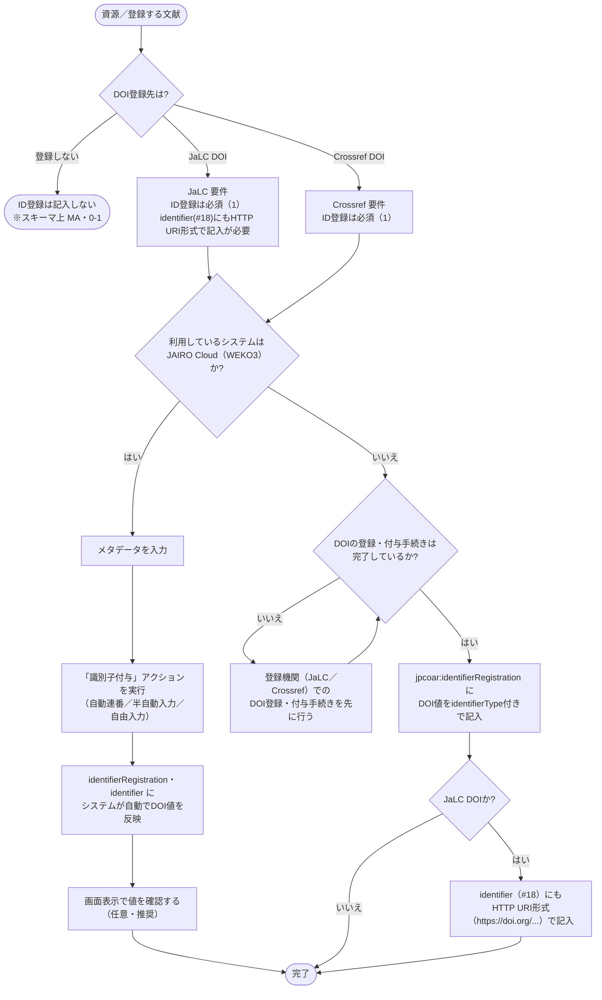

# ID登録 入力フローチャート

初心者が JPCOARスキーマの **ID登録** を迷わず入力できるよう、フローチャートで道筋をたどり、対応表で使用する要素・属性を確定します。

対象: JPCOARスキーマ **2.0**（要素 [#19 ID登録](https://schema.irdb.nii.ac.jp/ja/schema/2.0/19)）
利用シーン: **DOI登録（JaLC / Crossref）を重視**。要素・属性の定義は [ID登録記述ルール（公式準拠）](../reference/identifier_registration_rules.md)、必須度は [JPCOAR/JaLC対照表 ver.1.5](../reference/JPCOAR_JaLC_Crossref_requirements.md) に準拠。

`jpcoar:identifierRegistration` はスキーマ上 **MA（該当する場合は必須・繰返不可・0-1）** ですが、DOI登録（JaLC / Crossref）では **必須（1）** です。`identifierType` 属性は **M（必須）** で、必ず登録機関を指定します。要素の内容には **DOIなど識別子の値そのもの** を記入します（`identifierType` はその値がどの機関の識別子かを示す属性）。

## この項目の性質

4観点の定義は [CONVENTIONS.md 第8節](CONVENTIONS.md) を参照。

| 観点 | 評価 |
|------|------|
| 入力の型 | **転記型**が中心 — 付与されたDOIの値と登録機関（`identifierType`）を転記する。JAIRO Cloud（WEKO3）利用時はシステムが「識別子付与」アクション実行後に自動反映するため、担当者による転記作業そのものが原則不要 |
| 他項目への影響 | あり（最大級）— 全フローチャート共通の「DOI登録先は?」分岐の前提となるハブ要素。JaLCの場合は識別子（#18）にもHTTP URI形式のDOIを記入する必要があり、直接連動する |
| 事前調査 | 必要 — DOIの登録・付与手続きが完了しているか、利用しているシステムがJAIRO Cloud（自動反映）かそれ以外（手動転記）かを確認する |
| 誤入力の影響 | DOI登録エラー（必須項目未達で登録画面がエラーに戻る）、非推奨URIスキームでの記入によるスキーマ違反、識別子（#18）との不整合によるDOI解決リンク切れ |

---

## まず入力するもの

| 入力したい情報 | 入力先 | 基本ルール |
|--------------|--------|------------|
| DOI登録先（機関） | `identifierType`（属性） | `JaLC` / `Crossref` から選択（`DataCite` / `PMID` は公式語彙にあるが本ガイドの対象外） |
| 付与されたDOIの値 | `jpcoar:identifierRegistration` | 要素の内容に識別子文字列そのものを記入（URL表記・`doi:`等のスキームは不可） |
| JaLC登録時の識別子への反映 | `jpcoar:identifier`（#18） | `identifierType="URI"` でHTTP URI形式（`https://doi.org/...`）でも記入 |

---

## 記号凡例

記号・記入レベル（M / MA / O 等）・`xml:lang` 運用方針は [CONVENTIONS.md](CONVENTIONS.md) を参照してください。

---

## ID登録入力フローチャート



> **ポイント**: `identifierType` の選択（JaLC / Crossref）は**スキーマ層**の話、実際のDOI付与操作（JAIRO Cloudの「識別子付与」アクション等）は本フローチャートが扱う**メタデータ記入**とは別の**システム操作**です。JAIRO Cloud利用機関は、システムに任せてよい部分（DOI値の反映）と自分で確認する部分（値の妥当性）が分かれます。

---

## 入力プロセス対応表

| 判断 | 質問 | 回答 | アクション | 要素・属性 | 入力例 |
|------|------|------|-----------|-----------|--------|
| #1 | DOI登録先は | 登録しない | ID登録は記入しない（スキーマ上 MA・0-1） | ― | ― |
| | | JaLC / Crossref | ID登録は必須（1）。#2 へ | `jpcoar:identifierRegistration` | |
| #2 | 利用システムは | JAIRO Cloud（WEKO3） | メタデータ入力後「識別子付与」アクションを実行。システムが自動反映 | `jpcoar:identifierRegistration` / `jpcoar:identifier` | |
| | | それ以外 | #3 へ | ― | ― |
| #3 | DOI登録・付与手続きは完了しているか | いいえ | 登録機関でのDOI登録・付与手続きを先に行う | ― | ― |
| | | はい | DOI値を`identifierType`付きで記入 | `jpcoar:identifierRegistration identifierType="JaLC"` | 10.18926/AMO/54590 |
| #4 | JaLC DOIか | はい | identifier（#18）にもHTTP URI形式で記入 | `jpcoar:identifier identifierType="URI"` | https://doi.org/10.18926/AMO/54590 |
| | | いいえ（Crossref） | 完了 | ― | ― |

---

## 使い分けの目安

| 迷いやすいケース | 判断 | 入力先 |
|----------------|------|--------|
| ID登録（#19）と識別子（#18）の違い | ID登録＝どの機関にDOI登録したか／識別子＝資源自体の所在（HDL・URI） | `jpcoar:identifierRegistration`（ID登録）／`jpcoar:identifier`（識別子） |
| JaLCでDOI登録した場合の識別子への反映要否 | 必要 — `identifier`にもHTTP URI形式で併記する | `jpcoar:identifier identifierType="URI"` |
| JAIRO Cloud（WEKO3）利用時のDOI値の扱い | システムが「識別子付与」アクション実行後に自動反映するため、手動でDOI文字列を用意する必要は原則ない | ― |
| DOI登録を行わない資源 | ID登録・識別子ともに記入しない（スキーマ上任意） | ― |

---

## 入力例

### JaLC DOI（識別子との併記）

```xml
<jpcoar:identifier identifierType="URI">https://doi.org/10.18926/AMO/54590</jpcoar:identifier>
<jpcoar:identifierRegistration identifierType="JaLC">10.18926/AMO/54590</jpcoar:identifierRegistration>
```

### Crossref DOI

```xml
<jpcoar:identifierRegistration identifierType="Crossref">10.1234/example.2016.001</jpcoar:identifierRegistration>
```

---

## 注記（入力ルール）

- **要素の必須度**: `jpcoar:identifierRegistration` はスキーマ上 MA（該当する場合は必須・繰返不可・0-1）。DOI登録（JaLC / Crossref）では **必須（1）** です。
- **要素の内容とURL表記の禁止**: 要素の内容には識別子の値そのもの（例: `10.18926/AMO/54590`）を記入します。`info:doi/`・`doi:` のURIスキームや、`https://doi.org/...` のURL表記を `identifierRegistration` に使うことは非推奨（禁止）です。URL表記が必要な場合は `identifier`（#18）側で扱います。
- **識別子（#18）との連動**: JaLC でDOIを登録する場合は、`identifierRegistration` だけでなく `identifier`（#18）にもHTTP URI形式で記入する必要があります（出典: 公式記述ルール）。識別子（#18）のフローチャートは別ページ（[Issue #4](https://github.com/tzhaya/jpcoarschema-helper/issues/4)で作成予定）で扱います。
- **JAIRO Cloud (WEKO3) 利用機関向けの補足**: DOIの実際の付与は、ワークフローの「識別子付与」アクション（自動連番／半自動入力／自由入力）で行います。個別登録ではメタデータ入力後にこのアクションを実行し、DOIプレフィックスはシステム設定値、サフィックスは自動採番が原則です（一括登録では「識別子変更モード」でサフィックスを任意設定できます）。この画面では **Crossref DOI も選択可能**です。本フローチャートはメタデータ要素の記入方法を扱うものであり、DOI付与操作そのものの手順は [JPCOAR JAIRO Cloudマニュアル 3.4 DOIの付与](https://jpcoar.org/support/jairo-cloud/manual/item-registration/) を参照してください。JAIRO Cloud以外のシステムを利用する機関では、DOI取得後にその値を手動で `identifierRegistration` に転記します。
- **統制語彙の範囲**: `identifierType` の統制語彙には `DataCite`・`PMID`（非推奨・現在不使用）もありますが、本ガイドはJaLC/Crossref DOI登録を主眼とするため、フローチャートの分岐はJaLC/Crossrefの二択のみとしています。DataCite DOIを登録する場合も要素・属性の使い方は同様です。
- **DOI登録先による差分**（[対照表](../reference/JPCOAR_JaLC_Crossref_requirements.md) より）:
  - **JaLC DOI**: ID登録は必須（1）。識別子（#18）へのHTTP URI形式での併記が必要。
  - **Crossref DOI**: ID登録は必須（1）。

---

## 参考

- JPCOARスキーマ 2.0 #19 ID登録: https://schema.irdb.nii.ac.jp/ja/schema/2.0/19
- 要素・属性の記述ルール（公式準拠）: [identifier_registration_rules.md](../reference/identifier_registration_rules.md)
- 必須項目・DOI要件: [JPCOAR_JaLC_Crossref_requirements.md](../reference/JPCOAR_JaLC_Crossref_requirements.md)
- JAIRO Cloud (WEKO3) のDOI付与操作: [JPCOAR JAIRO Cloudマニュアル 3.4 DOIの付与](https://jpcoar.org/support/jairo-cloud/manual/item-registration/)
- 識別子（#18）フローチャート: [Issue #4](https://github.com/tzhaya/jpcoarschema-helper/issues/4)（作成予定）
- 手法の出典: Subirats, I. and Zeng, M.L. 2020. *Linked Open Data Enabled Bibliographical Data (LODE-BD) 3.0*. Rome, FAO. https://doi.org/10.4060/cb2209en
