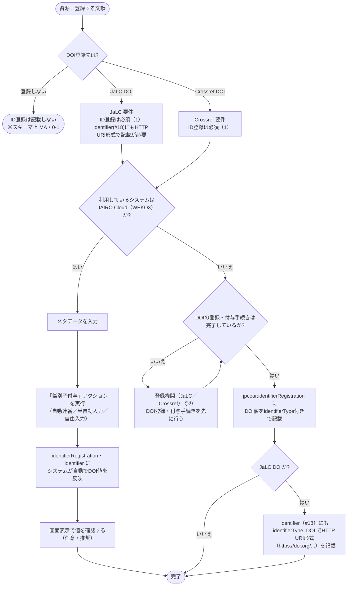

# ID登録 入力フローチャート

ID登録には、DOIのURLではなく、登録機関と識別子文字列を記載します。
同じDOIでも、`jpcoar:identifierRegistration` と `jpcoar:identifier` では値の形式と役割が異なります。
JAIRO Cloud ではシステムが値を反映するため、手入力の要否も利用環境によって変わります。

まず DOI登録先を確定し、JAIRO Cloud の自動反映を利用するか、値を手動で記載するかを判断します。
JaLC DOI の場合は、識別子（#18）への併記も確認します。

対象は JPCOARスキーマ **2.0** の [#19 ID登録](https://schema.irdb.nii.ac.jp/ja/schema/2.0/19) です。
要素と属性の定義は [ID登録記述ルール（公式準拠）](../reference/identifier_registration_rules.md)、DOI登録時の必須度は [JPCOAR/JaLC対照表 ver.1.5](../reference/JPCOAR_JaLC_Crossref_requirements.md) を典拠とします。

`jpcoar:identifierRegistration` は **MA（該当する場合は必須）、0-1（繰返不可）** です。
DOIなどを登録する場合に1つだけ記載します。
JaLC DOI と Crossref DOI の登録では **必須（1）** です。
`identifierType` 属性は **M（必須）、1（繰返不可）** です。
要素の内容には識別子の値そのものを記載し、属性で登録機関を示します。

## この項目の性質

評価の定義は [CONVENTIONS.md 第8節](CONVENTIONS.md) を参照してください。

| 観点 | 評価 |
|------|------|
| 入力の型 | **転記型**が中心。付与されたDOIの値と登録機関を転記する。JAIRO Cloud ではシステムが自動反映するため、担当者による転記は原則不要 |
| 他項目への影響 | **あり（最大級）**。各フローチャートの「DOI登録先」分岐の前提となる。JaLC DOI では識別子（#18）への併記が必要 |
| 事前調査 | 必要。DOIの登録と付与が完了しているか、JAIRO Cloud の自動反映を利用するか確認する |
| 誤入力の影響 | DOI登録エラー（必須項目未達で登録画面がエラーに戻る）、非推奨URIスキームでの記載によるスキーマ違反、識別子（#18）との不整合によるDOI解決リンク切れ |

---

## まず入力するもの

| 入力したい情報 | 入力先 | 基本ルール |
|--------------|--------|------------|
| DOI登録先（機関） | `identifierType`（属性） | `JaLC` / `Crossref` から選択する（`DataCite` / `PMID` は公式語彙にあるが本ガイドの対象外） |
| 付与されたDOIの値 | `jpcoar:identifierRegistration` | 識別子文字列そのものを記載する（URL表記や `doi:` などのスキームは不可） |
| JaLC登録時の識別子への反映 | `jpcoar:identifier`（#18） | `identifierType="DOI"` でHTTP URI形式（`https://doi.org/...`）でも記載する |

---

## 記号凡例

記号・記入レベル（M / MA / O 等）・`xml:lang` 運用方針は [CONVENTIONS.md](CONVENTIONS.md) を参照してください。

---

## ID登録入力フローチャート



> **判断の要点**：`identifierType` は、識別子を登録した機関を示します。
> JAIRO Cloud の「識別子付与」は、DOIを付与して値を要素へ反映するシステム操作です。
> 自動反映を利用する場合も、登録先と反映された値が一致しているか確認します。

---

## 入力プロセス対応表

| 判断 | 質問 | 回答 | アクション | 要素・属性 | 入力例 |
|------|------|------|-----------|-----------|--------|
| #1 | DOI登録先は | 登録しない | ID登録は記載しない（スキーマ上 MA・0-1） | ― | ― |
| | | JaLC / Crossref | ID登録は必須（1）。#2 へ | `jpcoar:identifierRegistration` | |
| #2 | 利用システムは | JAIRO Cloud（WEKO3） | メタデータ入力後「識別子付与」アクションを実行。システムが自動反映 | `jpcoar:identifierRegistration` / `jpcoar:identifier` | |
| | | それ以外 | #3 へ | ― | ― |
| #3 | DOI登録・付与手続きは完了しているか | いいえ | 登録機関でのDOI登録・付与手続きを先に行う | ― | ― |
| | | はい | DOI値を `identifierType` 付きで記載 | `jpcoar:identifierRegistration identifierType="JaLC"` | 10.18926/AMO/54590 |
| #4 | JaLC DOIか | はい | identifier（#18）にも `identifierType="DOI"` でHTTP URI形式を記載 | `jpcoar:identifier identifierType="DOI"` | https://doi.org/10.18926/AMO/54590 |
| | | いいえ（Crossref） | 完了 | ― | ― |

---

## 使い分けの目安

迷いやすいのは、ID登録（#19）と識別子（#18）に同じ形式の値を入れてしまうことです。
ID登録には `prefix/suffix` 形式、識別子には資源自身を示すHTTP URI形式などを記載します。

| 迷いやすいケース | 判断 | 入力先 |
|----------------|------|--------|
| ID登録（#19）と識別子（#18）の違い | ID登録は登録サービスと `prefix/suffix` 形式の値、識別子は資源自身のID（DOI、HDL、URI） | `jpcoar:identifierRegistration`（ID登録）と `jpcoar:identifier`（識別子） |
| JaLCでDOI登録した場合の識別子への反映要否 | 必要。`identifierType="DOI"` でHTTP URI形式を併記する | `jpcoar:identifier identifierType="DOI"` |
| DOI登録を行わない資源 | ID登録（#19）は記載しない。識別子（#18）はスキーマ上 M のため、HDL または URI 等を記載する | `jpcoar:identifier` |

---

## 入力例

### JaLC DOI（識別子との併記）

```xml
<jpcoar:identifier identifierType="DOI">https://doi.org/10.18926/AMO/54590</jpcoar:identifier>
<jpcoar:identifierRegistration identifierType="JaLC">10.18926/AMO/54590</jpcoar:identifierRegistration>
```

### Crossref DOI

```xml
<jpcoar:identifierRegistration identifierType="Crossref">10.1234/example.2016.001</jpcoar:identifierRegistration>
```

---

## 注記（入力ルール）

### スキーマ層

- `jpcoar:identifierRegistration` は MA、0-1です。
  JaLC、Crossref、DataCite などへ識別子を登録する場合に1つだけ記載します。
- `identifierType` は M、1です。
  `JaLC`、`Crossref`、`DataCite`、`PMID` から登録機関を示す値を選びます。
- 要素の内容には、`10.18926/AMO/54590` のような識別子文字列を記載します。
  `info:doi/`、`doi:`、`https://doi.org/...` などのURIやURLは使用できません。
- 資源自身の識別子は、識別子（#18）に記載します。
- ID登録（#19）は、JaLCとのデータ連携のためにのみ使用します。
- JaLC DOI と Crossref DOI は、junii2 の `selfDOI` に対応します。
- JaLC で DOI を登録する場合は、識別子（#18）にも `identifierType="DOI"` でHTTP URI形式を記載します。
- DOI登録の詳細は、[IRDBデータ提供機関のためのDOI管理・メタデータ入力ガイドライン：JPCOARスキーマ編](http://id.nii.ac.jp/1458/00000135/)に従います。

### DOI登録層

[対照表](../reference/JPCOAR_JaLC_Crossref_requirements.md) では、JaLC DOI と Crossref DOI のどちらも ID登録が **必須（1）** です。

JaLC DOI では、識別子（#18）へのHTTP URI形式の併記も必要です。
Crossref DOI では、ID登録に `identifierType="Crossref"` を指定します。

### 本ガイドの運用方針

- JAIRO Cloud を利用する場合は、メタデータ入力後に「識別子付与」アクションを実行します。
  システムが `identifierRegistration` と `identifier` に値を反映するため、担当者は登録先と値を確認します。
- JAIRO Cloud 以外のシステムでは、DOIの登録と付与が完了した後に `identifierRegistration` へ値を転記します。
- `identifierType` の統制語彙には `DataCite` と `PMID` もあります。
  本ガイドは JaLC DOI と Crossref DOI を重視するため、フローチャートではこの2つを分岐させます。
- JAIRO Cloud の操作手順は [JPCOAR JAIRO Cloudマニュアル 3.4 DOIの付与](https://jpcoar.org/support/jairo-cloud/manual/item-registration/) を参照してください。

---

## 参考

- JPCOARスキーマ 2.0 #19 ID登録: https://schema.irdb.nii.ac.jp/ja/schema/2.0/19
- DOI登録の詳細: [IRDBデータ提供機関のためのDOI管理・メタデータ入力ガイドライン：JPCOARスキーマ編](http://id.nii.ac.jp/1458/00000135/)
- 要素・属性の記述ルール（公式準拠）: [identifier_registration_rules.md](../reference/identifier_registration_rules.md)
- 必須項目・DOI要件: [JPCOAR_JaLC_Crossref_requirements.md](../reference/JPCOAR_JaLC_Crossref_requirements.md)
- JAIRO Cloud (WEKO3) のDOI付与操作: [JPCOAR JAIRO Cloudマニュアル 3.4 DOIの付与](https://jpcoar.org/support/jairo-cloud/manual/item-registration/)
- 識別子（#18）フローチャート: [identifier.md](identifier.md)
- 手法の出典: Subirats, I. and Zeng, M.L. 2020. *Linked Open Data Enabled Bibliographical Data (LODE-BD) 3.0*. Rome, FAO. https://doi.org/10.4060/cb2209en
