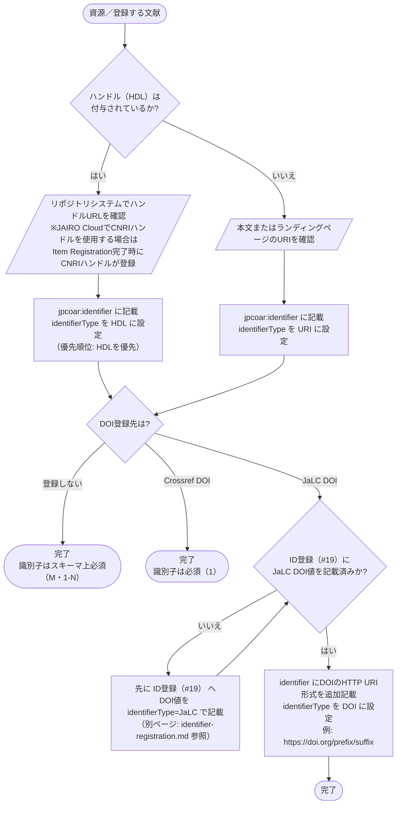

# 識別子 入力フローチャート

識別子には、DOI、ハンドル、URIのどれでも入れられます。
ただし、利用できる値をすべて同じように記載するわけではありません。
ハンドルとURIには優先順位があり、JaLC DOIを登録する場合は、別要素のID登録と同じDOIを異なる形式で記載します。

まずリポジトリコンテンツ自身の識別子を確定し、ハンドルがあれば優先して記載します。
そのうえで、JaLC DOI登録時に必要なDOIのHTTP URI形式を追加します。

対象は JPCOARスキーマ **2.0** の [#18 識別子](https://schema.irdb.nii.ac.jp/ja/schema/2.0/18) です。
要素と属性の定義は [識別子記述ルール（公式準拠）](../reference/identifier_rules.md)、DOI登録時の必須度は [JPCOAR/JaLC対照表 ver.1.5](../reference/JPCOAR_JaLC_Crossref_requirements.md) を典拠とします。

`jpcoar:identifier` は **M（必須）、1-N（1つ以上、繰返可）** です。
DOI登録の有無にかかわらず、リポジトリコンテンツ自身の識別子を必ず1つ以上記載します。
`identifierType` は **M（必須）、1（繰返不可）** です。
統制語彙は `DOI`、`HDL`、`URI` の3種類です。
DOIの登録機関と `prefix/suffix` 形式の値は、別要素のID登録（#19）で扱います。

## この項目の性質

評価の定義は [CONVENTIONS.md 第8節](CONVENTIONS.md) を参照してください。

| 観点 | 評価 |
|------|------|
| 入力の型 | **転記型**が中心。ハンドルURLやランディングページのURIをリポジトリシステムと書誌情報から転記する。JaLC DOI登録時は、ID登録（#19）のDOIをHTTP URI形式でも転記する |
| 他項目への影響 | **与える影響はあり**。JaLC DOI登録の場合はID登録（#19）と直接連動し、同じDOIをHTTP URI形式、`identifierType="DOI"` で本要素にも記載する |
| 事前調査 | **必要**。ハンドルの有無をリポジトリシステムで確認する。JaLC DOI登録の場合は、ID登録（#19）の記載状況も確認する |
| 誤入力の影響 | DOI登録エラー（必須項目未達）、DOI登録層の優先順位（HDL > URI）の取り違え、ID登録(#19)との不整合によるDOI解決リンク切れ、出版社版DOI等の誤混入によるスキーマ上の意味の誤り |

---

## まず入力するもの

| 入力したい情報 | 入力先 | 基本ルール |
|--------------|--------|------------|
| ハンドル（HDL） | `jpcoar:identifier identifierType="HDL"` | ハンドルが付与されていれば優先して記載する |
| 本文／ランディングページのURI | `jpcoar:identifier identifierType="URI"` | ハンドルがない場合に記載する |
| JaLC DOI登録時のDOI（HTTP URI形式） | `jpcoar:identifier identifierType="DOI"` | ID登録（#19）のDOI値を `https://doi.org/...` 形式に変換して追加記載する |
| 出版社版DOI、他誌掲載DOIなど | `jpcoar:relation`（本ガイド対象外） | 識別子（#18）には記入しない |

---

## 記号凡例

記号・記入レベル（M / MA 等）・`xml:lang` 運用方針は [CONVENTIONS.md](CONVENTIONS.md) を参照してください。

---

## 識別子入力フローチャート



> **判断の要点**：ID登録（#19）は、登録機関と `prefix/suffix` 形式のDOI値を記録します。
> 識別子（#18）が記録するのは、リポジトリコンテンツ自身の識別子です。
> JaLC DOI登録の場合は、同じDOIを識別子（#18）にもHTTP URI形式、`identifierType="DOI"` で追加記載します。

---

## 入力プロセス対応表

| 判断 | 質問 | 回答 | アクション | 要素・属性 | 入力例 |
|------|------|------|-----------|-----------|--------|
| #0 | ハンドル（HDL）は付与されているか | はい | リポジトリシステムでハンドルURLを確認し、`identifierType` をHDLに設定して記載（優先順位：HDLを優先） | `jpcoar:identifier identifierType="HDL"` | http://hdl.handle.net/2115/64495 |
| | | いいえ | 本文またはランディングページのURIを確認し、`identifierType` をURIに設定して記載 | `jpcoar:identifier identifierType="URI"` | https://example.repo.jp/records/1234 |
| #1 | DOI登録先は | 登録しない | 完了（識別子はスキーマ上必須・1-N） | ― | ― |
| | | Crossref DOI | 完了（識別子は必須・1） | ― | ― |
| | | JaLC DOI | ID登録（#19）にJaLC DOI値を記載済みか確認 | ― | ― |
| #2 | ID登録（#19）にJaLC DOI値を記載済みか | いいえ | 先にID登録（#19）へDOI値を `identifierType="JaLC"` で記載してから戻る | `jpcoar:identifierRegistration identifierType="JaLC"` | 10.18926/AMO/54590 |
| | | はい | identifierにDOIのHTTP URI形式を追加記載（`identifierType` は `DOI`） | `jpcoar:identifier identifierType="DOI"` | https://doi.org/10.18926/AMO/54590 |

---

## 使い分けの目安

値の種類だけでは、入力先を決められません。
その識別子がリポジトリコンテンツ自身を指すのか、外部の版を指すのかを先に確認します。

| 迷いやすいケース | 判断 | 入力先 |
|----------------|------|--------|
| ハンドルとURIの両方が用意できる場合、どちらを記載するか | 優先順位はHDLを優先する（対照表: 優先順 HDL > URI） | `jpcoar:identifier identifierType="HDL"` |
| JaLC DOIを登録した資源のidentifierへの記載要否 | ID登録（#19）のDOI値をHTTP URI形式（`https://doi.org/...`）に変換し、`identifierType="DOI"` で識別子にも追加記載する | `jpcoar:identifier identifierType="DOI"` |
| 識別子（#18）とID登録（#19）の違い | 識別子は資源自身のID（DOI、HDL、URI）、ID登録は登録サービスと `prefix/suffix` 形式の値を記録する | `jpcoar:identifier`（識別子）、`jpcoar:identifierRegistration`（ID登録） |
| 出版社版DOI、他誌掲載DOIなどの扱い | 識別子（#18）には記入せず、関連情報 `jpcoar:relation` に記入する。本要素にはリポジトリ自身のIDだけを記載する | `jpcoar:relation`（本ガイド対象外） |

---

## 入力例

### ハンドルのみ

```xml
<jpcoar:identifier identifierType="HDL">http://hdl.handle.net/2115/64495</jpcoar:identifier>
```

### URIのみ（ハンドルがない場合）

```xml
<jpcoar:identifier identifierType="URI">https://example.repo.jp/records/1234</jpcoar:identifier>
```

### JaLC DOI登録時（ハンドル＋DOIのURI形式を併記）

```xml
<jpcoar:identifier identifierType="HDL">http://hdl.handle.net/2115/64495</jpcoar:identifier>
<jpcoar:identifier identifierType="DOI">https://doi.org/10.18926/AMO/54590</jpcoar:identifier>
<jpcoar:identifierRegistration identifierType="JaLC">10.18926/AMO/54590</jpcoar:identifierRegistration>
```

---

## 注記（入力ルール）

### スキーマ層

- `jpcoar:identifier` は M、1-Nです。
  DOI登録の有無にかかわらず、少なくとも1つ記載します。
- `identifierType` は M、1です。
  公式の統制語彙 `DOI`、`HDL`、`URI` から、値の種類に合うものを1つ選びます。
- 本要素には、リポジトリコンテンツ自身のIDを記載します。
  学術雑誌論文の出版社版DOIなど、外部のDOIは `jpcoar:relation` に記載します。
- JaLC DOIを登録する場合は、`jpcoar:identifierRegistration` にも登録するDOIを `prefix/suffix` 形式で記載します。

### DOI登録層

[対照表](../reference/JPCOAR_JaLC_Crossref_requirements.md) では、登録先によって次の要件が加わります。

| DOI登録先 | 識別子 | 優先順位 | DOIのHTTP URI形式 |
|-----------|--------|----------|-------------------|
| JaLC DOI | 必須（1） | HDL > URI | ID登録（#19）のDOI値を `identifierType="DOI"` で識別子にも追加記載する |
| Crossref DOI | 必須（1） | HDL > URI | 追加要件なし |

本ガイドでは、JaLC DOI登録時の `identifierType="DOI"` は、HDLとURIの優先順位とは別の要件と解釈します。

### 本ガイドの運用方針

- ハンドルとURIの両方が利用できる場合は、対照表の優先順位に従ってハンドルを記載します。
- 識別子（#18）とID登録（#19）を混同しないよう、JaLC DOIの値と形式を両方の要素で照合します。
- JAIRO Cloud（WEKO3）でCNRIハンドルを使用する場合は、Item Registrationアクションの完了時点で登録されるため、登録後の画面で値を確認します。
  JaLC DOIを登録する場合は、「識別子付与」アクション実行後にDOIのURI形式が識別子（#18）へ反映されていることも確認します。
  詳細は [ID登録フローチャート](identifier-registration.md) を参照してください。

---

## 参考

- JPCOARスキーマ 2.0 #18 識別子: https://schema.irdb.nii.ac.jp/ja/schema/2.0/18
- 要素・属性の記述ルール（公式準拠）: [identifier_rules.md](../reference/identifier_rules.md)
- 必須項目・DOI要件: [JPCOAR_JaLC_Crossref_requirements.md](../reference/JPCOAR_JaLC_Crossref_requirements.md)
- JAIRO Cloud（WEKO3）のCNRIハンドル登録: [JPCOAR JAIRO Cloudマニュアル 3.5 アイテム承認](https://jpcoar.org/support/jairo-cloud/manual/item-registration/)
- ID登録（#19）フローチャート: [identifier-registration.md](identifier-registration.md)
- 手法の出典: Subirats, I. and Zeng, M.L. 2020. *Linked Open Data Enabled Bibliographical Data (LODE-BD) 3.0*. Rome, FAO. https://doi.org/10.4060/cb2209en
