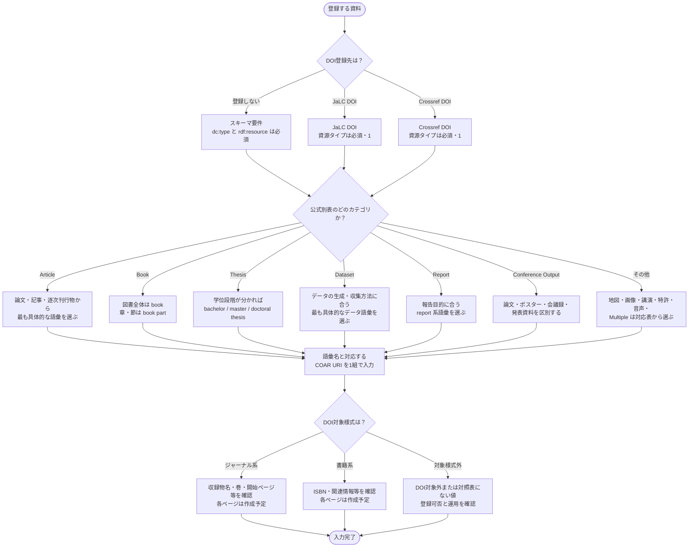

# 資源タイプ 入力フローチャート

資源タイプは、資料に書かれた名称をそのまま転記する項目ではありません。
「論文」「報告書」「会議資料」のような資料上の呼称が同じでも、内容、公開単位、刊行形態によって選ぶ語彙が変わります。
選択した値は、DOI登録の対象様式と後続項目の必須度にも波及します。

まず資料が公式別表のどのカテゴリに属するかを見定め、最も具体的な語彙を1つ選びます。
そのうえで、DOI登録先に応じた対象様式と後続項目を確認します。

対象は JPCOARスキーマ **2.0** の [#15 資源タイプ](https://schema.irdb.nii.ac.jp/ja/schema/2.0/15) です。
要素と属性の定義は [資源タイプ記述ルール（公式準拠まとめ）](../reference/resource_type_rules.md)、DOI登録時の対象様式は [JPCOAR/JaLC対照表 ver.1.5](../reference/JPCOAR_JaLC_Crossref_requirements.md) を典拠とします。

`dc:type` は **M（必須）、1（繰返不可）** です。
`rdf:resource` も **M（必須）、1（繰返不可）** です。
公式の資源タイプ語彙から1つを選び、対応するCOAR URIと組にして記載します。

## この項目の性質

評価の定義は [CONVENTIONS.md 第8節](CONVENTIONS.md) を参照してください。

| 観点 | 評価 |
|------|------|
| 入力の型 | **解釈型**。資料の内容と公開形態を解釈し、公式の資源タイプ語彙から1つを選ぶ |
| 他項目への影響 | **与える影響はあり**。選択した値が DOI の対象様式と、収録物名、巻号ページ、ISBN、学位情報などの必須度に波及する。ID登録で選ぶ DOI 登録先からも影響を受ける |
| 事前調査 | **必要**。本文、表紙、目次、掲載誌や紀要、会議情報、ISBN、学位種別などを確認する |
| 誤入力の影響 | DOI 対象様式を誤ると後続項目の必須チェックが崩れ、DOI登録エラーや不適切なメタデータ変換につながる |

---

## まず入力するもの

| 入力したい資源タイプ | 入力先 | 基本ルール |
|----------------------|--------|------------|
| 単独の論文、記事 | `dc:type` と `rdf:resource` | 掲載元と内容を確認し、Articleカテゴリから最も具体的な語彙を選ぶ |
| 図書全体、章や節 | `dc:type` と `rdf:resource` | 図書全体は `book`、章や節は `book part` とする |
| 学位論文 | `dc:type` と `rdf:resource` | 学位段階が分かれば学位別の語彙を選び、特定できない場合は `thesis` とする |
| 報告書、データ、会議資料など | `dc:type` と `rdf:resource` | 本文冒頭、刊行目的、生成方法などから対応する語彙を選ぶ |
| DOI登録の対象様式 | 後続項目 | ID登録のDOI登録先と、選択した資源タイプを組み合わせて確認する |

---

## 記号凡例

記号・記入レベル（M / MA 等）・`xml:lang` 運用方針は [CONVENTIONS.md](CONVENTIONS.md) を参照してください。

---

## 資源タイプ入力フローチャート

> Article、Book、Thesis、Dataset、Report は公式語彙別表のカテゴリ名です。
> Conference Output は、公式別表のカテゴリ見出し `Conference object` の配下にある現行語彙名 `conference output` に合わせた表示です。
> 残るカテゴリを「その他」にまとめるのは、図を読みやすくするための**本ガイドの運用上の区分**です。



> **判断の要点**：資源タイプは、DOI登録先だけでは決まりません。
> 資料の内容と公開単位から公式語彙を選び、その値とDOI登録先の組み合わせで対象様式を確認します。

---

## 入力プロセス対応表

| 判断 | 質問 | 回答 | アクション | 要素・属性 | 入力例 |
|------|------|------|-----------|-----------|--------|
| #0 | DOI登録先は？ | 登録しない | スキーマ要件に従い、公式語彙から1つ選ぶ | `dc:type @rdf:resource` | |
| | | JaLC DOI | JaLC の対象様式を確認する | 同上 | |
| | | Crossref DOI | Crossref の対象様式を確認する | 同上 | |
| #1 | 公式別表のどのカテゴリか？ | Article | 論文・記事・逐次刊行物を区別する | 同上 | `journal article` |
| | | Book | 完結した図書か章・節かを区別する | 同上 | `book part` |
| | | Thesis | 学位段階が判明していれば下位語を選ぶ | 同上 | `doctoral thesis` |
| | | Dataset | 生成・収集方法に合う語彙を選ぶ | 同上 | `survey data` |
| | | Report | 報告目的に合う語彙を選ぶ | 同上 | `research report` |
| | | Conference Output | 論文・ポスター・会議録・発表資料を区別する | 同上 | `conference poster` |
| | | その他 | 公式別表の残るカテゴリから選ぶ | 同上 | `software` |
| #2 | DOI対象様式は？ | ジャーナル系 | 収録物名・巻・開始ページ等の後続項目を確認する | — | — |
| | | 書籍系 | ISBN等の後続項目を確認する | — | — |
| | | 対象様式外 | DOI登録可否と機関運用を確認する | — | — |

---

## 使い分けの目安

迷いやすい語彙は、資料上の呼称だけでは区別できません。
掲載元、資料の完結単位、学位段階、会議での公開形態を確認すると、候補を絞れます。

### 境界で迷いやすい語彙

| 候補 | 判断の目安 |
|------|------------|
| `departmental bulletin paper`、`journal article`、`article` | 大学や研究所などの紀要類に掲載された論文は `departmental bulletin paper`、学術雑誌掲載の研究論文は `journal article`、それ以外の学術論文ではない記事は `article`。3語とも URI は `c_6501` で、DOI対象様式はジャーナル系のため、迷っても対象様式は変わらない |
| 紀要類の表紙・目次 | 公式の資源タイプ語彙別表では、紀要類の表紙や目次は `departmental bulletin paper` ではなく `other` とする |
| `book`、`book part` | 1巻またはセットで完結し、原則として ISBN で識別される資料全体は `book`。図書の章や節は `book part` |
| `thesis`と学位別3種 | 学位段階が判明していれば `bachelor thesis`、`master thesis`、`doctoral thesis` を優先し、段階を特定できない場合は `thesis` |
| `conference paper`、`conference poster`、`conference proceedings`、`conference presentation`、`conference output` | 会議録掲載論文、ポスター、会議録全体、スライド資料をそれぞれ専用語彙にする。これらに当てはまらない会議の電子資料全般は `conference output` |
| `journal`、`other periodical` | 学術研究や最新動向を広める逐次刊行物そのものは `journal`。既存の語彙に該当しない「テキスト」資料は `other periodical` |

### 現行2.0語彙にない概念

| 概念 | JPCOAR 2.0での扱い |
|------|--------------------|
| `preprint` | 資源タイプ語彙には存在しない。論文のバージョン情報は出版タイプ `oaire:version`（#17）で表現し、DOI登録時の `dc:type` は `other` とする |
| `periodical` | [JPCOAR 1.0.2の公式別表](https://schema.irdb.nii.ac.jp/ja/resource_type_vocabulary)には掲載されていますが、2.0の公式別表にはありません。対照表 ver.1.5 のジャーナル系一覧にも残っています。本ガイドでは、スキーマ層では資料の定義に応じて2.0語彙の `journal`、`other periodical` などから選ぶと解釈します |
| `internal report`、`report part` | [JPCOAR 1.0.2の公式別表](https://schema.irdb.nii.ac.jp/ja/resource_type_vocabulary)には掲載されていますが、2.0の公式別表にはありません。本ガイドでは、資料の定義に応じて `report`、`research report`、`technical report` などから選ぶと解釈します |
| `conference object` | 旧称。2.0では語彙名 `conference output` を使用する（URI `c_c94f` は同一） |

---

## 入力例

### 学術雑誌論文

```xml
<dc:type rdf:resource="http://purl.org/coar/resource_type/c_6501">journal article</dc:type>
```

### 紀要論文

```xml
<dc:type rdf:resource="http://purl.org/coar/resource_type/c_6501">departmental bulletin paper</dc:type>
```

### 博士論文

```xml
<dc:type rdf:resource="http://purl.org/coar/resource_type/c_db06">doctoral thesis</dc:type>
```

### データセット

```xml
<dc:type rdf:resource="http://purl.org/coar/resource_type/c_ddb1">dataset</dc:type>
```

---

## 注記（入力ルール）

### スキーマ層

- `dc:type` は M、1です。
  一つの資料に一つの資源タイプを記載します。
- `rdf:resource` は M、1です。
  [公式別表](https://schema.irdb.nii.ac.jp/ja/2.0/resource_type_vocabulary)から語彙を1つ選び、対応するCOAR URIと組にして入力します。
- `departmental bulletin paper`、`journal article`、`article` は同じURI `http://purl.org/coar/resource_type/c_6501` を共有します。
  URIだけで判断せず、公式定義に沿って要素値を区別します。
- 版の情報は資源タイプではなく、別の要素に記載します。
  論文のバージョン情報は出版タイプ `oaire:version`（#17、MA、0-1）、データのバージョン情報はバージョン情報 `datacite:version`（#16、O、0-1）を使用します。
  公式は前者を「論文の場合、必ず記入する」、後者を「データの場合のみ使用する」と定めています。

### DOI登録層

JaLC DOIとCrossref DOIでは、資源タイプはともに **必須（1）** です。
対象様式は、登録先によって次のように異なります。

| 対象様式 | JaLC DOI | Crossref DOI |
|----------|----------|--------------|
| ジャーナル系 | `conference paper`, `departmental bulletin paper`, `journal article`, `periodical`, `review article`, `data paper`, `editorial`, `article`, `newspaper (v1.0.2)`, `software paper (v1.0.2)`, `other (Preprintのみ)` | 同左 |
| 書籍系 | `book`, `book part`, `technical report`, `research report`, `report` | JaLC DOIの5種に `thesis`, `bachelor thesis`, `master thesis`, `doctoral thesis` を加えた9種 |

JaLC DOIの書籍系にthesis系は含まれません。
また、対照表の `periodical` とPreprintの表現にはJPCOAR 2.0語彙との版差があるため、「現行2.0語彙にない、または廃止された概念」の判断に従います。

### 本ガイドの運用方針

- 複数の候補がある場合は、資料を最も具体的に表す1語を選びます。
- 公式別表の12カテゴリのうち、頻出する6カテゴリをフローチャートの主分岐にし、残りを「その他」にまとめています。
  この集約は、語彙の追加や変更ではありません。
- DOI対象様式が確定したら、収録物名、巻号ページ、ISBN、学位情報などの後続項目を確認します。

---

## 参考

- JPCOARスキーマ 2.0 #15 資源タイプ: https://schema.irdb.nii.ac.jp/ja/schema/2.0/15
- 資源タイプ語彙別表【Ver2.0】: https://schema.irdb.nii.ac.jp/ja/2.0/resource_type_vocabulary
- JPCOARスキーマ 2.0 #16 バージョン情報: https://schema.irdb.nii.ac.jp/ja/schema/2.0/16
- JPCOARスキーマ 2.0 #17 出版タイプ: https://schema.irdb.nii.ac.jp/ja/schema/2.0/17
- 要素・属性の記述ルール: [resource_type_rules.md](../reference/resource_type_rules.md)
- DOI登録要件: [JPCOAR_JaLC_Crossref_requirements.md](../reference/JPCOAR_JaLC_Crossref_requirements.md)
- ID登録: [identifier-registration.md](identifier-registration.md)
- 収録物名・巻号ページ・ISBN等の入力ガイド: 作成予定
