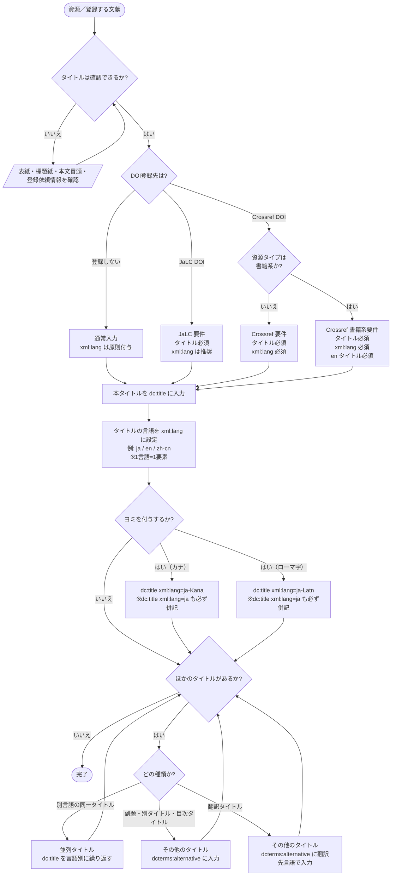

# タイトル 入力フローチャート

初心者が JPCOARスキーマの **タイトル** を迷わず入力できるよう、フローチャートで道筋をたどり、対応表で使用する要素・属性を確定します。

対象: JPCOARスキーマ **2.0**（要素 [#1 タイトル](https://schema.irdb.nii.ac.jp/ja/schema/2.0/1) / [#2 その他のタイトル](https://schema.irdb.nii.ac.jp/ja/schema/2.0/2)）
利用シーン: **DOI登録（JaLC / Crossref）を重視**。必須度・`xml:lang` 要件は [JPCOAR/JaLC対照表 ver.1.5](../reference/JPCOAR_JaLC_Crossref_requirements.md) に準拠。

---

## まず入力するもの

| 入力したいタイトル | 入力先 | 基本ルール |
|------------------|--------|------------|
| 本タイトル | `dc:title` | 資源を代表するタイトルを1言語ずつ入力する |
| 別言語の同一タイトル（並列タイトル） | `dc:title` | 言語ごとに `dc:title` を繰り返す |
| 副題・別タイトル・目次タイトル | `dcterms:alternative` | 「その他のタイトル」(#2) として入力する |
| 翻訳タイトル | `dcterms:alternative` | 翻訳先言語の `xml:lang` を付ける |
| カナ読み・ローマ字読み | `dc:title` | `ja-Kana` / `ja-Latn` を使い、`ja` の本文タイトルも併記する |

`xml:lang` は、JPCOAR/JaLC DOI では推奨、Crossref DOI では必須です。このガイドでは入力漏れと多言語混在を防ぐため、**原則としてすべてのタイトルに付与**します。

---

## 記号凡例（フローチャート共通）

| 記号 | 意味 |
|------|------|
| 楕円 `([ ])` | 開始 / 終了 |
| ひし形 `{ }` | 判断（Yes / No や種類の分岐） |
| 長方形 `[ ]` | 処理（入力・設定する内容） |
| 平行四辺形 `[/ /]` | 入力・情報源 |

---

## タイトル入力フローチャート



> **ポイント**: DOIの登録有無により、必要な要素が変わります。Crossref DOI では `xml:lang` が必須で、書籍系ではさらに `en` タイトルが必須になります。

---

## 入力プロセス対応表

| 判断 | 質問 | 回答 | アクション | 要素・属性 | 入力例 |
|------|------|------|-----------|-----------|--------|
| #0 | タイトルは確認できるか | いいえ | 表紙・標題紙・本文冒頭・登録依頼情報を確認し #0 へ戻る | ― | ― |
| | | はい | #1（DOI登録先）へ | ― | ― |
| #1 | DOI登録先は | 登録しない | 通常入力で続行。`xml:lang` は原則付与 | `dc:title` | |
| | | JaLC DOI | タイトル必須。`xml:lang` は推奨 | `dc:title` | |
| | | Crossref DOI | 資源タイプが書籍系か確認 | `dc:title` | |
| #1a | Crossref DOI の資源タイプは書籍系か | いいえ | `xml:lang` 必須で続行 | `dc:title` | |
| | | はい | `xml:lang` 必須、かつ `en` タイトル必須で続行 | `dc:title xml:lang="en"` | Studies on agrometeorology |
| #2 | 本タイトルの言語は | 日本語 | 言語コードを設定 | `dc:title xml:lang="ja"` | 農業気象の研究 |
| | | 英語 | 言語コードを設定 | `dc:title xml:lang="en"` | Studies on agrometeorology |
| | | 中国語 | 言語コードを設定 | `dc:title xml:lang="zh-cn"` | 农业气象研究 |
| #3 | ヨミを付与するか | カナ | `ja` の本文タイトルと併記 | `dc:title xml:lang="ja-Kana"` | ノウギョウキショウノケンキュウ |
| | | ローマ字 | `ja` の本文タイトルと併記 | `dc:title xml:lang="ja-Latn"` | Nogyo kisho no kenkyu |
| | | いいえ | #4 へ | ― | ― |
| #4 | ほかのタイトルはあるか | 別言語の同一タイトル | 並列タイトルとして `dc:title` を言語別に繰り返す | `dc:title xml:lang="fr"` | Etudes sur l'agrometeorologie |
| | | 副題・別タイトル・目次タイトル | 「その他のタイトル」へ入力 | `dcterms:alternative xml:lang="ja"` | 第2版に向けて |
| | | 翻訳タイトル | 「その他のタイトル」へ翻訳先言語で入力 | `dcterms:alternative xml:lang="en"` | A study on agrometeorology |
| | | いいえ | 完了 | ― | ― |

---

## 使い分けの目安

| 迷いやすいケース | 判断 | 入力先 |
|----------------|------|--------|
| 日本語タイトル「農業気象の研究」と英語タイトル "Studies on agrometeorology" が同じ資料の代表タイトルとして示されている | 並列タイトル | それぞれ `dc:title` |
| タイトル「農業気象の研究」に副題「第2版に向けて」が付いている | 副題 | `dcterms:alternative` |
| 日本語タイトルに対して、説明用に英訳タイトル "A study on agrometeorology" を補う | 翻訳タイトル | `dcterms:alternative xml:lang="en"` |
| 日本語タイトルの読みを検索用に入れたい | ヨミ | `dc:title xml:lang="ja-Kana"` または `ja-Latn` |

---

## 入力例

### 日本語タイトルのみ

```xml
<dc:title xml:lang="ja">農業気象の研究</dc:title>
```

### 日本語タイトル＋英語並列タイトル＋カナヨミ

```xml
<dc:title xml:lang="ja">農業気象の研究</dc:title>
<dc:title xml:lang="en">Studies on agrometeorology</dc:title>
<dc:title xml:lang="ja-Kana">ノウギョウキショウノケンキュウ</dc:title>
```

### 本タイトル＋副題＋翻訳タイトル

```xml
<dc:title xml:lang="ja">農業気象の研究</dc:title>
<dcterms:alternative xml:lang="ja">第2版に向けて</dcterms:alternative>
<dcterms:alternative xml:lang="en">A study on agrometeorology</dcterms:alternative>
```

---

## 注記（入力ルール）

- **このガイドの運用方針**: `xml:lang` は原則付与します。JPCOAR/JaLC DOI では推奨、Crossref DOI では必須です。
- **1言語＝1要素**: 1つの `dc:title` や `dcterms:alternative` に複数言語を並べません。言語が異なる場合は要素を分けます。
- **同一言語コードの重複に注意**: 同じ種類のタイトルで同一 `xml:lang` の要素を重複させないようにします。
- **ヨミの併記ルール**: カナ読み (`ja-Kana`) やローマ字読み (`ja-Latn`) を入れる場合は、必ず `xml:lang="ja"` の本文タイトルも併せて記入します。
- **本タイトルと「その他のタイトル」の使い分け**: JPCOAR の「その他のタイトル」(#2) には DataCite のような `titleType` 属性がありません。副題・目次タイトル・翻訳タイトルなどは `dcterms:alternative` に入れ、`xml:lang` で言語を示します。
- **並列タイトル**: 同じ資料の代表タイトルが複数言語で示されている場合は、「その他のタイトル」ではなく `dc:title` を言語別に繰り返して表現します。
- **DOI登録先による差分**（[対照表](../reference/JPCOAR_JaLC_Crossref_requirements.md) より）:
  - **JaLC DOI**: タイトルは必須（1以上）、`xml:lang` は推奨。
  - **Crossref DOI（ジャーナルアーティクル等）**: タイトルは必須（1以上）、`xml:lang` は必須。
  - **Crossref DOI（書籍系）**: タイトルは必須（1以上）、`xml:lang` は必須、かつ `xml:lang="en"` のタイトルが必須。

---

## 参考

- JPCOARスキーマ 2.0 #1 タイトル: https://schema.irdb.nii.ac.jp/ja/schema/2.0/1
- JPCOARスキーマ 2.0 #2 その他のタイトル: https://schema.irdb.nii.ac.jp/ja/schema/2.0/2
- 必須項目・DOI要件: [JPCOAR_JaLC_Crossref_requirements.md](../reference/JPCOAR_JaLC_Crossref_requirements.md)
- 手法の出典: Subirats, I. and Zeng, M.L. 2020. *Linked Open Data Enabled Bibliographical Data (LODE-BD) 3.0*. Rome, FAO. https://doi.org/10.4060/cb2209en
