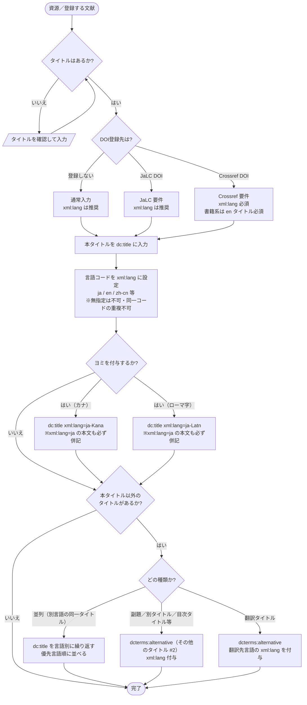

# タイトル 入力決定木（JPCOARスキーマ 2.0）

初心者が JPCOARスキーマの **タイトル** を迷わず入力できるよう、FAO の Linked Open Data Enabled Bibliographical Data (LODE-BD) 3.0 の決定木方式にならって作成したガイドです。フローチャートで道筋をたどり、対応表で使用する要素・属性と実例を確定します。

対象: JPCOARスキーマ **2.0**（要素 [#1 タイトル](https://schema.irdb.nii.ac.jp/ja/schema/2.0/1) / [#2 その他のタイトル](https://schema.irdb.nii.ac.jp/ja/schema/2.0/2)）
利用シーン: **DOI登録（JaLC / Crossref）を重視**。必須度・`xml:lang` 要件は [JPCOAR/JaLC対照表 ver.1.5](../reference/JPCOAR_JaLC_Crossref_requirements.md) に準拠。

---

## 記号凡例（全決定木共通）

| 記号 | 意味 |
|------|------|
| 楕円 `([ ])` | 開始 / 終了 |
| ひし形 `{ }` | 判断（Yes / No や種類の分岐） |
| 長方形 `[ ]` | 処理（入力・設定する内容） |
| 平行四辺形 `[/ /]` | 入力・情報源 |

---

## タイトル決定木

> **設計の要点**: 最初に「DOI登録先」を分岐させます。登録先が決まると、以降の `xml:lang` の必須度や言語要件が確定し、初心者の迷いが減るためです。

---

## 決定プロセス対応表

| 判断 | 質問 | 回答 | アクション | 要素・属性 | 入力例 |
|------|------|------|-----------|-----------|--------|
| #0 | タイトルはあるか | いいえ | 確認して入力し #0 へ戻る | ― | ― |
| | | はい | #1（DOI登録先）へ | ― | ― |
| #1 | DOI登録先は | 登録しない | 通常要件で続行（xml:lang推奨） | dc:title | |
| | | JaLC DOI | JaLC要件で続行（xml:lang推奨） | dc:title | |
| | | Crossref DOI | xml:lang必須・書籍系はenタイトル必須を確認 | dc:title | |
| #2 | 言語は | 日本語 | xml:lang設定 | `dc:title xml:lang="ja"` | 農業気象の研究 |
| | | 英語 | xml:lang設定 | `dc:title xml:lang="en"` | Studies on agrometeorology |
| | | 中国語 | xml:lang設定 | `dc:title xml:lang="zh-cn"` | 农业气象研究 |
| #3 | ヨミを付与するか | カナ | jaの本文と併記 | `dc:title xml:lang="ja-Kana"` | ノウギョウキショウノケンキュウ |
| | | ローマ字 | jaの本文と併記 | `dc:title xml:lang="ja-Latn"` | Nogyo kisho no kenkyu |
| | | いいえ | #4 へ | ― | ― |
| #4 | 本タイトル以外はあるか | 並列（別言語の同一タイトル） | dc:title を言語別に繰り返す | `dc:title`（言語別） | Études sur l'agrométéorologie |
| | | 副題／別タイトル／目次タイトル | その他のタイトルへ | `dcterms:alternative` | 第2版に向けて |
| | | 翻訳タイトル | その他のタイトルへ | `dcterms:alternative xml:lang="en"` | A study on agrometeorology |
| | | いいえ | 完了 | ― | ― |

---

## 注記（入力ルール）

- **xml:lang は実質必須**: スキーマガイドは「xml:lang指定なしの記入」「同一言語コードの重複要素」「複数言語を1要素に並列表記」を禁止しています。1言語＝1要素で、優先度の高い言語順に並べます。
- **ヨミの併記ルール**: カナ読み (`ja-Kana`) やローマ字読み (`ja-Latn`) を入れる場合は、必ず `xml:lang="ja"` の本文も併せて記入します。
- **本タイトルと「その他のタイトル」の使い分け**: JPCOAR の「その他のタイトル」(#2) には DataCite のような `titleType` 属性が**ありません**。副題・目次タイトル・翻訳タイトルなどはすべて `dcterms:alternative` に入れ、`xml:lang` で区別します。
- **並列タイトル**: 同じタイトルの別言語版は「その他のタイトル」ではなく、`dc:title` を言語別に繰り返して表現します。
- **DOI登録先による差分**（[対照表](../reference/JPCOAR_JaLC_Crossref_requirements.md) より）:
  - **JaLC DOI**: タイトルは必須（1以上）、`xml:lang` は推奨。
  - **Crossref DOI**: タイトルは必須（1以上）、`xml:lang` **必須**。**書籍系は en のタイトルが必須**。

---

## 参考

- JPCOARスキーマ 2.0 #1 タイトル: https://schema.irdb.nii.ac.jp/ja/schema/2.0/1
- JPCOARスキーマ 2.0 #2 その他のタイトル: https://schema.irdb.nii.ac.jp/ja/schema/2.0/2
- 必須項目・DOI要件: [JPCOAR_JaLC_Crossref_requirements.md](../reference/JPCOAR_JaLC_Crossref_requirements.md)
- 手法の出典: Subirats, I. and Zeng, M.L. 2020. *Linked Open Data Enabled Bibliographical Data (LODE-BD) 3.0*. Rome, FAO. https://doi.org/10.4060/cb2209en
