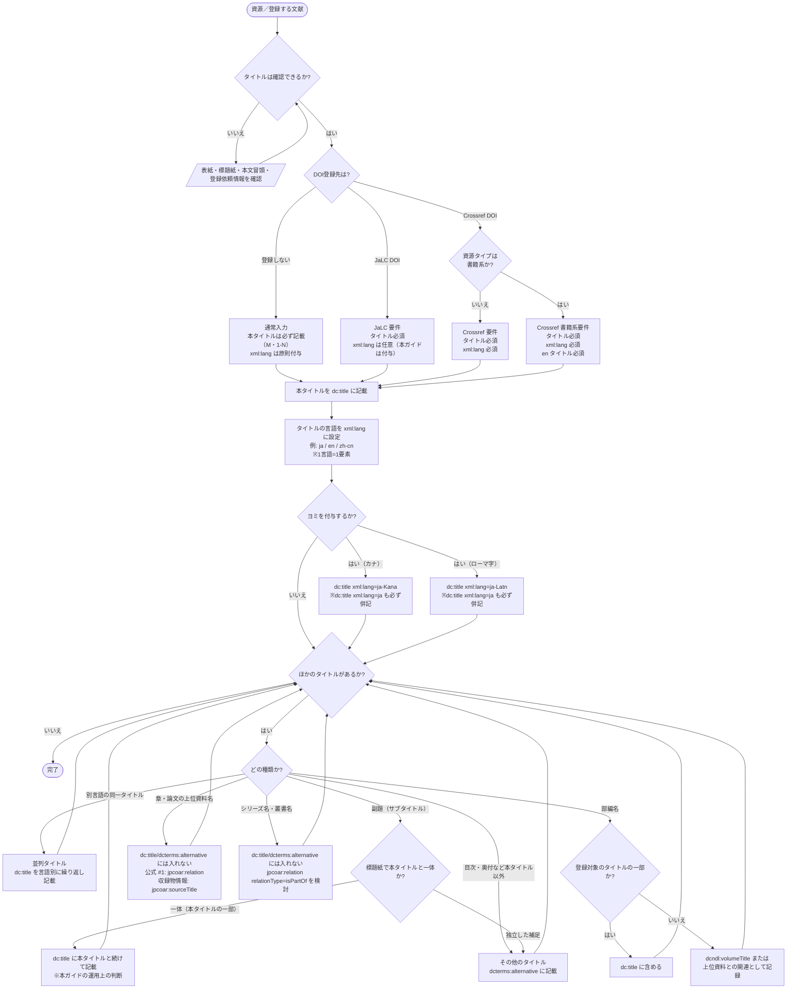

# タイトル 入力フローチャート

タイトルは転記が中心の項目です。
ただし、資料に書かれた文字列をすべて `dc:title` に写せばよいわけではありません。
別言語の代表タイトル、副題、目次タイトル、シリーズ名では、入力先が変わります。

まず資料を代表するタイトルを確定し、ほかのタイトルを種類ごとに振り分けます。
そのうえで、DOI登録先に応じた `xml:lang` 要件を適用します。

対象は JPCOARスキーマ **2.0** の [#1 タイトル](https://schema.irdb.nii.ac.jp/ja/schema/2.0/1) と [#2 その他のタイトル](https://schema.irdb.nii.ac.jp/ja/schema/2.0/2) です。
要素と属性の定義は [タイトル記述ルール（公式準拠）](../reference/title_rules.md)、DOI登録時の必須度と `xml:lang` 要件は [JPCOAR/JaLC対照表 ver.1.5](../reference/JPCOAR_JaLC_Crossref_requirements.md) を典拠とします。

`dc:title` は **M（必須）、1-N（1つ以上、繰返可）** です。
DOI登録の有無にかかわらず、資料を代表するタイトルを必ず記載します。
`dcterms:alternative` は **MA（該当する場合は必須）、0-N（繰返可）** です。
本タイトル以外のタイトルがある場合に記載します。

## この項目の性質

評価の定義は [CONVENTIONS.md 第8節](CONVENTIONS.md) を参照してください。

| 観点 | 評価 |
|------|------|
| 入力の型 | **転記型**が中心。資料に表示されたタイトルを写す。副題や並列タイトルの入力先を決める部分は解釈を伴う |
| 他項目への影響 | **与える影響はなし**。資源タイプの影響を受け、Crossref DOI の書籍系では英語タイトルが必須になる |
| 事前調査 | 不要。標題紙、奥付、書誌情報から判断できる |
| 誤入力の影響 | 検索と発見性の低下。必須タイトルや書籍系の英語タイトルが欠けると DOI 登録エラーになる |

---

## まず入力するもの

| 入力したいタイトル | 入力先 | 基本ルール |
|------------------|--------|------------|
| 本タイトル | `dc:title` | 資源を代表するタイトルを必ず1つ以上記載する |
| 別言語の同一タイトル（並列タイトル） | `dc:title` | 言語ごとに `dc:title` を繰り返し記載する |
| 独立した副題、目次タイトル、奥付タイトル | `dcterms:alternative` | 本タイトル以外のタイトルとして記載する。標題紙で本タイトルと一体の副題は、本ガイドの運用上 `dc:title` に含める |
| 章・論文を直接収録する図書名・雑誌名 | `jpcoar:relation` または `jpcoar:sourceTitle` | タイトル要素には入れない。JPCOAR #1 に従い上位資料との関連として記録し、収録物情報を構造化して記録する場合は `jpcoar:sourceTitle` を使用する |
| 独立した資料が属するシリーズ名・叢書名 | `jpcoar:relation relationType="isPartOf"` | タイトル要素や収録物名へ一律に割り当てない |
| カナ読み、ローマ字読み | `dc:title` | `ja-Kana` または `ja-Latn` を使い、`ja` の本文タイトルも併記する |

入力先を決めた後、タイトルの言語を `xml:lang` で示します。
スキーマ層では **MA（該当する場合は必須）**、DOI登録層では **JaLC DOI は任意、Crossref DOI は必須**です。
Crossref DOI の書籍系では、`xml:lang="en"` のタイトルも必須です。

本ガイドでは、入力漏れと多言語の混在を防ぐため、原則としてすべてのタイトルに `xml:lang` を付与します。

---

## 記号凡例

記号・記入レベル（M / MA 等）・`xml:lang` 運用方針は [CONVENTIONS.md](CONVENTIONS.md) を参照してください。

---

## タイトル入力フローチャート


```mermaid
flowchart TD
    R([資源／登録する文献]) --> D0{タイトルは確認できるか?}
    D0 -- いいえ --> A0[/表紙・標題紙・本文冒頭・登録依頼情報を確認/]
    A0 --> D0
    D0 -- はい --> Q1{DOI登録先は?}

    Q1 -- 登録しない --> CTX0["通常入力<br/>本タイトルは必ず記載（M・1-N）<br/>xml:lang は原則付与"]
    Q1 -- JaLC DOI --> CTX1["JaLC 要件<br/>タイトル必須<br/>xml:lang は任意（本ガイドは付与）"]
    Q1 -- Crossref DOI --> Q1a{資源タイプは<br/>書籍系か?}

    Q1a -- いいえ --> CTX2["Crossref 要件<br/>タイトル必須<br/>xml:lang 必須"]
    Q1a -- はい --> CTX3["Crossref 書籍系要件<br/>タイトル必須<br/>xml:lang 必須<br/>en タイトル必須"]

    CTX0 --> P1
    CTX1 --> P1
    CTX2 --> P1
    CTX3 --> P1

    P1["本タイトルを dc:title に記載"] --> P2["タイトルの言語を xml:lang に設定<br/>例: ja / en / zh-cn<br/>※1言語=1要素"]
    P2 --> D2{ヨミを付与するか?}

    D2 -- "はい（カナ）" --> A2a["dc:title xml:lang=ja-Kana<br/>※dc:title xml:lang=ja も必ず併記"]
    D2 -- "はい（ローマ字）" --> A2b["dc:title xml:lang=ja-Latn<br/>※dc:title xml:lang=ja も必ず併記"]
    D2 -- いいえ --> D3

    A2a --> D3
    A2b --> D3

    D3{ほかのタイトルがあるか?}
    D3 -- いいえ --> END
    D3 -- はい --> D3a{どの種類か?}

    D3a -- "別言語の同一タイトル" --> A3a["並列タイトル<br/>dc:title を言語別に繰り返し記載"]
    D3a -- "副題（サブタイトル）" --> D3b{標題紙で本タイトルと一体か?}
    D3a -- "目次・奥付など本タイトル以外" --> A3b["その他のタイトル<br/>dcterms:alternative に記載"]
    D3a -- "章・論文の上位資料名" --> A3d["dc:title/dcterms:alternative には入れない<br/>公式 #1: jpcoar:relation<br/>収録物情報: jpcoar:sourceTitle"]
    D3a -- "シリーズ名・叢書名" --> A3e["dc:title/dcterms:alternative には入れない<br/>jpcoar:relation relationType=isPartOf を検討"]
    D3a -- "部編名" --> D3c{登録対象のタイトルの一部か?}

    D3b -- "一体（本タイトルの一部）" --> A3c["dc:title に本タイトルと続けて記載<br/>※本ガイドの運用上の判断"]
    D3b -- "独立した補足" --> A3b
    D3c -- はい --> A3f["dc:title に含める"]
    D3c -- いいえ --> A3g["dcndl:volumeTitle または<br/>上位資料との関連として記録"]

    A3a --> D3
    A3b --> D3
    A3c --> D3
    A3d --> D3
    A3e --> D3
    A3f --> D3
    A3g --> D3

    END([完了])
```

> **判断の要点**：本タイトルの入力先は DOI 登録先によって変わりません。
> 変わるのは `xml:lang` の必須度です。
> Crossref DOI では `xml:lang` が必須となり、書籍系では英語タイトルも必要です。

---

## 入力プロセス対応表

| 判断 | 質問 | 回答 | アクション | 要素・属性 | 入力例 |
|------|------|------|-----------|-----------|--------|
| #0 | タイトルは確認できるか | いいえ | 表紙、標題紙、本文冒頭、登録依頼情報を確認し #0 へ戻る | ― | ― |
| | | はい | #1（DOI登録先）へ | ― | ― |
| #1 | DOI登録先は | 登録しない | 本タイトルは必ず記載する（スキーマ M、1-N）。`xml:lang` は原則付与する | `dc:title` | |
| | | JaLC DOI | タイトル必須。`xml:lang` は任意（本ガイドは付与） | `dc:title` | |
| | | Crossref DOI | 資源タイプが書籍系か確認 | `dc:title` | |
| #1a | Crossref DOI の資源タイプは書籍系か | いいえ | `xml:lang` 必須で続行 | `dc:title` | |
| | | はい | `xml:lang` 必須、かつ `en` タイトル必須で続行 | `dc:title xml:lang="en"` | Studies on agrometeorology |
| #2 | 本タイトルの言語は | 日本語 | 言語コードを設定 | `dc:title xml:lang="ja"` | 農業気象の研究 |
| | | 英語 | 言語コードを設定 | `dc:title xml:lang="en"` | Studies on agrometeorology |
| | | 中国語 | 言語コードを設定 | `dc:title xml:lang="zh-cn"` | 农业气象研究 |
| #3 | ヨミを付与するか | カナ | `ja` の本文タイトルと併記 | `dc:title xml:lang="ja-Kana"` | ノウギョウキショウノケンキュウ |
| | | ローマ字 | `ja` の本文タイトルと併記 | `dc:title xml:lang="ja-Latn"` | Nogyo kisho no kenkyu |
| | | いいえ | #4 へ | ― | ― |
| #4 | ほかのタイトルはあるか | 別言語の同一（代表）タイトル | 並列タイトルとして `dc:title` を言語別に繰り返し記載 | `dc:title xml:lang="fr"` | Etudes sur l'agrometeorologie |
| | | 副題（標題紙で本タイトルと一体） | 本ガイドの運用上、本タイトルの一部として `dc:title` に続けて記載 | `dc:title xml:lang="ja"` | 農業気象の研究：第2版に向けて |
| | | 独立した副題、目次タイトル、奥付タイトルなど | 「その他のタイトル」として記載する（該当する場合は必須、MA） | `dcterms:alternative xml:lang="ja"` | 第2版に向けて |
| | | 章・論文を直接収録する図書名・雑誌名 | `dc:title` と `dcterms:alternative` には入れない。JPCOAR #1 に従い上位資料との関連として記録し、収録物情報を構造化する場合は収録物名を使用する | `jpcoar:relation` / `jpcoar:sourceTitle` | （タイトルには記入しない） |
| | | 独立した資料が属するシリーズ名・叢書名 | タイトル要素や収録物名へ一律に割り当てず、シリーズ全体との関連として記録する | `jpcoar:relation relationType="isPartOf"` | （タイトルには記入しない） |
| | | 部編名 | 資料上の表示と構成を確認し、登録対象のタイトルの一部、部編名、上位資料との関連のいずれかを判断する | `dc:title` / `dcndl:volumeTitle` / `jpcoar:relation` | 第1部　基礎編 |
| | | いいえ | 完了 | ― | ― |

---

## 使い分けの目安

迷いやすいのは、文字列の言語ではなく、そのタイトルが資料を代表しているかどうかです。
別言語であっても代表タイトルなら `dc:title`、代表ではない訳題なら `dcterms:alternative` に記載します。

| 迷いやすいケース | 判断 | 入力先 |
|----------------|------|--------|
| 日本語タイトル「農業気象の研究」と英語タイトル "Studies on agrometeorology" が同じ資料の代表タイトルとして示されている | 並列タイトル（別言語の代表タイトル） | それぞれ `dc:title` |
| 標題紙で本タイトルと一体に表示された副題（例「農業気象の研究：第2版に向けて」） | 本タイトルの一部 | `dc:title` に続けて記載 |
| 本タイトルとは独立した補足の副題「第2版に向けて」 | その他のタイトル | `dcterms:alternative` |
| 代表タイトルの別言語版ではない訳題（代表でない翻訳タイトル） | その他のタイトル | `dcterms:alternative`（独自の「翻訳タイトル」区分は作らず、代表性で振り分ける） |
| 翻訳資料で原著の原タイトルも示したい | 原タイトル | 翻訳資料自体の代表タイトルは `dc:title`、原タイトルは `dcterms:alternative` または関連情報 |
| 章・論文を直接収録する図書名・雑誌名 | 登録対象に対する上位資料 | `dc:title` と `dcterms:alternative` には入れず、`jpcoar:relation` で関連を記録する。収録物情報を構造化して記録する場合は `jpcoar:sourceTitle` を使用する |
| 独立した資料が属するシリーズ名・叢書名（例「◯◯叢書」） | シリーズ全体との関連 | 原則として `jpcoar:relation relationType="isPartOf"`。`jpcoar:sourceTitle` へ一律に割り当てない |
| 部編名（例「第1部　基礎編」） | 登録対象のタイトル構成を確認 | タイトルの一部なら `dc:title`、独立した部編名なら `dcndl:volumeTitle`、上位資料を示す場合は `jpcoar:relation` を検討する |
| 日本語タイトルの読みを検索用に入れたい | ヨミ | `dc:title xml:lang="ja-Kana"` または `ja-Latn` |

---

## 入力例

### 日本語タイトルのみ

```xml
<dc:title xml:lang="ja">農業気象の研究</dc:title>
```

### 日本語タイトル、英語並列タイトル、カナヨミ

```xml
<dc:title xml:lang="ja">農業気象の研究</dc:title>
<dc:title xml:lang="en">Studies on agrometeorology</dc:title>
<dc:title xml:lang="ja-Kana">ノウギョウキショウノケンキュウ</dc:title>
```

### 本タイトルと一体の副題

```xml
<dc:title xml:lang="ja">農業気象の研究：第2版に向けて</dc:title>
```

### 独立した副題

```xml
<dc:title xml:lang="ja">農業気象の研究</dc:title>
<dcterms:alternative xml:lang="ja">第2版に向けて</dcterms:alternative>
```

---

## 注記（入力ルール）

### スキーマ層

- `dc:title` は M、1-Nです。
  本タイトルを必ず1つ以上記載し、複数言語がある場合は要素を繰り返します。
- `dcterms:alternative` は MA、0-Nです。
  本タイトル以外のタイトルがある場合に記載し、該当するタイトルがなければ省略します。
- `xml:lang` は両要素とも MA、0-1です。
  一つの要素に複数の言語を並べず、言語ごとに要素を分けます。
- `dc:title` は各言語コードにつき1回までです。
  `dcterms:alternative` は、同じ言語コードでも複数回記載できます。
- `dc:title` は優先度の高い言語から記載します。
- カナヨミ `ja-Kana` またはローマ字ヨミ `ja-Latn` を記載する場合は、`xml:lang="ja"` の本タイトルも併記します。
- 掲載誌名や上位資料名は、`dc:title` と `dcterms:alternative` のどちらにも混入させません。
  章などを収録する図書全体は、JPCOAR #1 に従い `jpcoar:relation` に記録します。
  雑誌名・図書名などの収録物情報を構造化して記録する場合は `jpcoar:sourceTitle` を使用します。

### DOI登録層

[対照表](../reference/JPCOAR_JaLC_Crossref_requirements.md) では、登録先によって次の要件が加わります。

| DOI登録先 | タイトル | `xml:lang` | 英語タイトル |
|-----------|----------|------------|----------------|
| JaLC DOI | 必須（1以上） | 任意 | 必須ではない |
| Crossref DOI（ジャーナルアーティクルなど） | 必須（1以上） | 必須 | 必須ではない |
| Crossref DOI（書籍系） | 必須（1以上） | 必須 | `xml:lang="en"` が必須 |

Crossref DOI の書籍系は、`book`、`book part`、`technical report`、`research report`、`report`、thesis 系を指します。

### 本ガイドの運用方針

- 入力漏れと多言語の混在を防ぐため、すべてのタイトルに `xml:lang` を付与します。
- 公式は、本タイトルと本タイトル以外のタイトルを区別しています。
  ただし、副題の表示形態による詳細な判定までは定めていません。
  本ガイドでは、標題紙で本タイトルと一体に表示された副題を `dc:title` に含め、独立した補足を `dcterms:alternative` に記載します。
- 「翻訳タイトル」という独立した区分は設けません。
  別言語の代表タイトルは `dc:title`、代表ではない訳題は `dcterms:alternative` に振り分けます。
- 翻訳資料では、その資料自体の代表タイトルを `dc:title` に記載します。
  原著の原タイトルは `dcterms:alternative` または関連情報で扱います。
- シリーズ名・叢書名は、タイトル要素や収録物名へ一律に割り当てません。
  独立した資料が属するシリーズ・叢書として記録する場合は、原則として `jpcoar:relation` の `relationType="isPartOf"` を使用します。
  これは、JPCOAR #20 のシリーズに関する説明と、国立国会図書館「メタデータ流通ガイドライン：古典籍編」の対応表に基づく運用です。
- 部編名は資料上の表示と構成を確認し、登録対象そのもののタイトルの一部、`dcndl:volumeTitle` に記録する部編名、上位資料との関連のいずれに当たるかを判断します。
  個別事例の境界は公式資料だけでは一律に確定できないため、この判定は本ガイドの運用方針です。

---

## 参考

- JPCOARスキーマ 2.0 #1 タイトル: https://schema.irdb.nii.ac.jp/ja/schema/2.0/1
- JPCOARスキーマ 2.0 #2 その他のタイトル: https://schema.irdb.nii.ac.jp/ja/schema/2.0/2
- JPCOARスキーマ 2.0 #20 関連情報: https://schema.irdb.nii.ac.jp/ja/schema/2.0/20
- JPCOARスキーマ 2.0 #25 収録物名: https://schema.irdb.nii.ac.jp/ja/schema/2.0/25
- JPCOARスキーマ 2.0 #37 部編名: https://schema.irdb.nii.ac.jp/ja/schema/2.0/37
- 国立国会図書館 メタデータ流通ガイドライン：古典籍編: https://ndlsearch.ndl.go.jp/guideline/historical
- 要素・属性の記述ルール（公式準拠）: [title_rules.md](../reference/title_rules.md)
- 必須項目・DOI要件: [JPCOAR_JaLC_Crossref_requirements.md](../reference/JPCOAR_JaLC_Crossref_requirements.md)
- 手法の出典: Subirats, I. and Zeng, M.L. 2020. *Linked Open Data Enabled Bibliographical Data (LODE-BD) 3.0*. Rome, FAO. https://doi.org/10.4060/cb2209en
